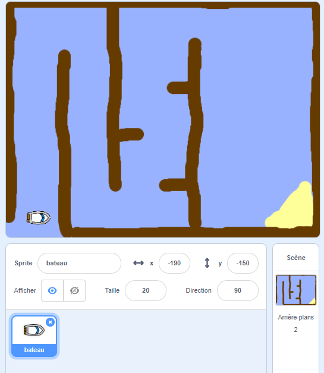

## Pour commencer

\--- task \---

Ouvre le projet de démarrage.

## \--- collapse \---

title: J'utilise Scratch en ligne

## image: images/image.png

Ouvre le project de démarrage de Scratch 'Course de Bateaux' sur [jumpto.cc/boat-go](https://scratch.mit.edu/projects/63958014/#editor){:target="_blank"}. \--- /collapse \---

## \--- collapse \---

title: J'utilise Scratch hors ligne

## image: images/image.png

Télécharge le projet de démarrage Scratch 'Course de Bateaux' depuis [ jumpto.cc/boat-get ](http:jumpto.cc/boat-get) {: target = "_ blank"}, et ouvre-le avec l'éditeur hors ligne. \--- /collapse \---

\--- /task \---

\--- task \---

Ce projet comprend un lutin de bateau et un arrière-plan avec:

- Bois que ton bateau doit éviter
- Une île déserte à laquelle ton bateau doit arriver
    
    

\--- /task \---