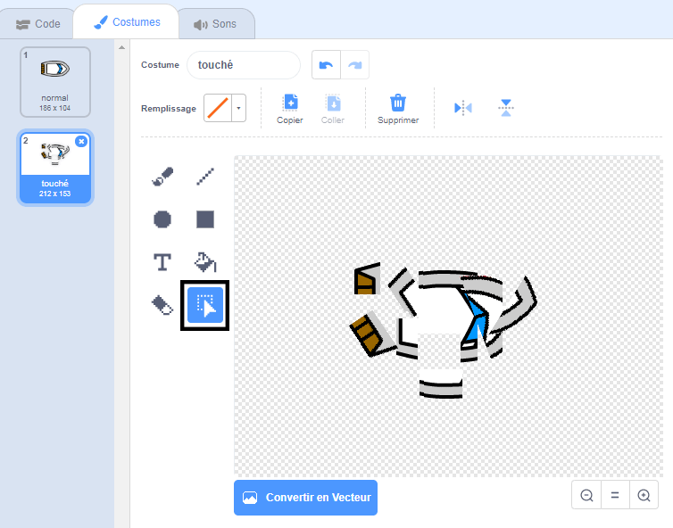

## Collision!

Pour le moment, le sprite du bateau peut simplement naviguer à travers les barrières de bois! Tu vas résoudre ce problème maintenant.

\--- task \---

Tu auras besoin de deux costumes pour ton sprite bateau: un costume normal et un pour le crash du bateau. Duplique le costume de ton sprite bateau et nomme un costume "normal" et l'autre "touché".

\--- /task \---

\--- task \---

Clique sur ton costume "touché", et utilise l'outil **Sélectionner** pour récupérer des pièces du costume et les déplacer et les faire tourner pour le faire ressembler à bateau qui est détruit en plusieurs morceaux.



\--- /task \---

\--- task \---

Ajoute maintenant du code à ton bateau pour qu’il se brise au contact des barrières en bois brun.

\--- hints \--- \--- hint \--- Tu dois ajouter des blocs de code à l'intérieur de ta boucle `répéter indéfiniment`{:class="block3control"} pour que ton code continue de vérifier si le sprite de bateau s'est échoué, et si il s'est échoué, le code doit réinitialiser la position du sprite de bateau.

`si`{:class="block3control"} le bateau `touche`{:class="block3sensing"} la couleur brune du bois, tu dois `passer au costume touché`{:class="block3looks"}, `dire Noooonn! pendant 2 secondes`{:class="block3looks"}, puis `revenir au costume normal`{:class="block3looks"}. Enfin, tu dois `pointer vers le haut`{:class="block3motion"} et `aller à la position de départ`{:class="block3motion"}.

\--- /hint \--- \--- hint \--- Voici les blocs de code dont tu auras besoin : 

```blocks3
si <touching color [ ] ?> alors
fin

allez à x: (-190) y: (-150)

changez de costume en (touché v)

s'orienter en direction de (0)

basculer sur le costume (normal v)

dire [Noooonn!] pendant (2) secondes
```

\---/hint\--- \---hint\--- Voici a quoi devrait ressembler ton code: 

```blocks3
lorsque le drapeau est cliqué
pointer dans la direction (0)
aller à x: (-190) y: (-150)
répéter indéfiniment
si <(distance de (pointeur de souris v)) > [5]> alors
s'orienter vers (pointeur de souris v)
déplacez de (1) pas
fin
si <touching color [#663b00] ?> alors
basculer sur le costume (touché v)
dire [Noooonn!] pendant (2) secondes
basculer sur le costume (normal v)
s'orienter en direction de (0)
aller à x: (-190) y: (-150)
fin
```

\--- /hint \--- \--- /hints \---

\--- /task \---

\--- task \---

Tu dois également ajouter du code pour t'assurer que ton sprite de bateau commence toujours à paraître «normal».

Teste ton code à nouveau. Si tu essaies maintenant de faire passer le bateau à travers une barrière en bois, le bateau devrait s'écraser puis revenir à sa position de départ.


\--- /task \---