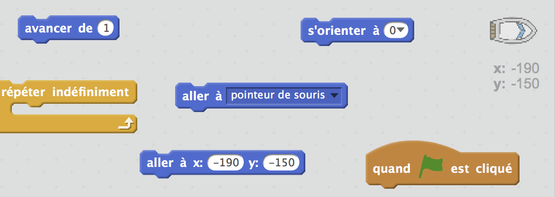
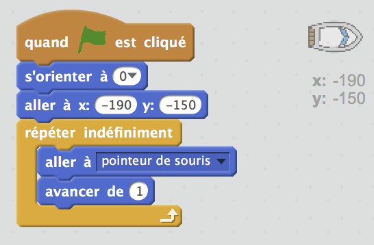
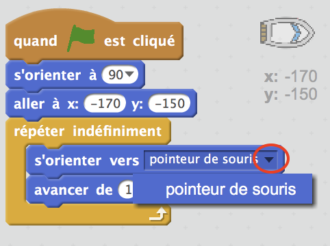
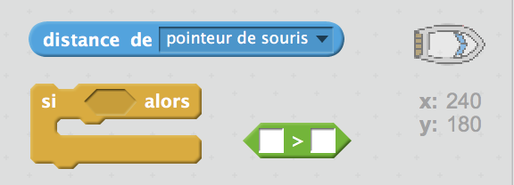
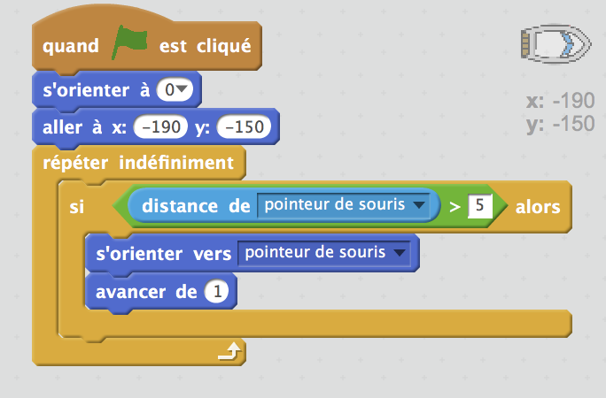

## Contrôler le bateau

\--- task \---

Tu vas contrôler le bateau avec ton souris. Ajoute du code à ton bateau afin qu'il commence dans le coin inférieur gauche, orienté vers le haut, et puis qu'il suive le pointeur de souris. **Teste ton code** pour verifier qu'il fat ce qu'il devrait faire.

\--- hints \--- \--- hint \--- Quand `le drapeau vert est cliqué`, tu dois envoyer ton bateau `à la position de départ` et `s'orienter vers le haut`. Ensuite, il faudra `s'orienter vers le pointeur de souris` et `avancer d'un pas`. Ceci doit être répété `indéfiniment`.

\--- /hint \--- \--- hint \--- Voici les blocs de code dont tu auras besoin:  \--- /hint \--- \--- hint \--- Ton code devrait ressembler à ceci:  \--- /hint \--- \--- /hints \---

\--- /task \---

\--- task \---

Teste ton bateau en cliquant sur le drapeau et en déplaçant la souris. Est-ce que le bateau navigue vers la souris?

## \--- collapse \---

title: Si tu as des problèmes ...

## image: images/image.png

**Remarque:** Pour l'instant il y a un problème avec Scratch ce qui veut dire que ton bateau ne va peut-être pas se déplacer vers le pointeur de souris. Dans ce cas, clique sur la flèche du bloc `s'orienter vers` et re-selectionner `pointeur de souris`.

 \--- /collapse \---

\--- /task \---

\--- task \---

Que se passe-t-il si le bateau atteint le pointeur de souris? Essaie.

\--- /task \---

\--- task \---

Pour empêcher cela, tu dois ajouter à ton code un bloc`si`, pour que le bateau ne bouge que s'il est à plus de 5 pixels de la souris.

\--- hints \--- \--- hint \--- Le bateau doit seulement pointer vers le pointeurs de souris et avancer `si` `la distance du pointeur de souris` est `supérieur à 5 pixels`. \--- /hint \--- \--- hint \--- Voici les blocs de code dont tu auras besoin:  \--- /hint \--- \--- hint \--- Ton code devrait ressembler à ceci:  \--- /hint \--- \--- /hints \---

\--- /task \---

\--- task \---

Re-teste ton bateau pour vérifier si le problème a été résolu.

\--- /task \---