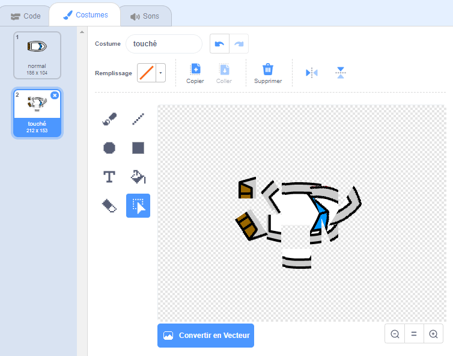
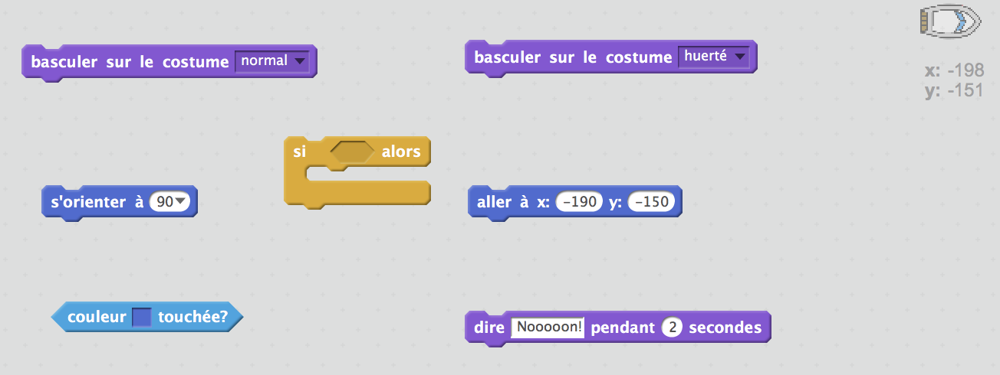
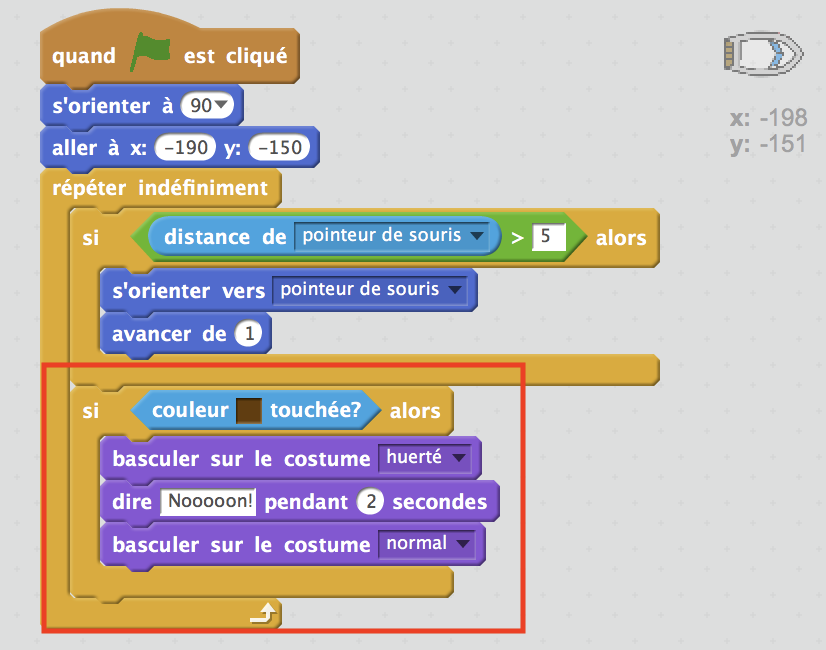
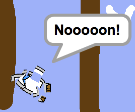

## Collision!

Pour le moment, ton bateau peut naviguer à travers les barrières en bois! Réglons ça.

\--- task \---

Tu auras besoin de deux costumes pour ton bateau, un costume normal, et un pour quand le bateau se heurte à un obstacle. Duplique ton costume de bateau, et nomme un costume «normal» et l'autre «heurté».

\--- /task \---

\--- task \---

Clique sur ton costume 'heurté', et choisis l'outil 'Selectionner' pour saisir les morceaux du bateau, les déplacer et les faire pivoter pour donner l'impression qu'il est abimé.

\--- /task \---

\--- task \---

Maintenant, ajoute du code à ton bateau afin qu'il se heurte et qu'il s'abime quand il touche des morceaux de bois marrons.

\--- hints \--- \--- hint \--- Il faudra shouter le code dedans ton bloc `indéfiniment` pour que ton code continue à verifier si le bateau s'est heurté. `Si` le bateau `touche` la burn du boiswood, il faudra `basculer sur le costume heurté`, `dire Noooon! pendant 2 secondes`, puis `re-bascule au costume normal`. Enfin, tu dois `pointer vers le haut` et `aller à la position de départ` . \--- /hint \--- \--- hint \--- Voici les blocs de code dont tu auras besoin:  \--- /hint \--- \--- hint \--- Ton code devrait ressembler à ceci:  \--- /hint \--- \--- /hints \---

\--- /task \---

\--- task \---

Tu dois également t'assurer que ton bateau commence avec l'air «normal».

Si tu essaies de naviguer à travers un obstacle de bois maintenant, tu devrais voir que ton bateau s'écrase et revient au départ.

\--- /task \---