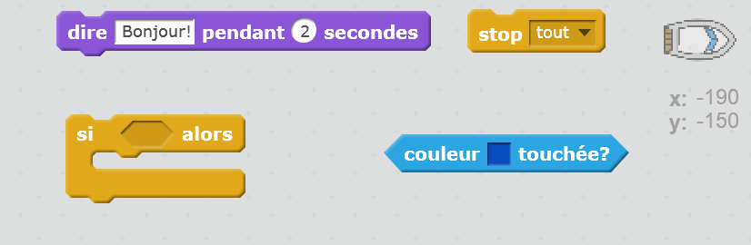
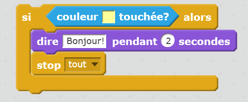

## Défi: gagner!

Peux-tu ajouter un autre bloc `si` au code de ton bateau, pour que le joueur gagne quand il arrive à l'île déserte?

Quand le bateau arrivera à l'île déserte jaune, le jeu devrait dire « BRAVO! » et s'arrêter.

\--- hints \--- \--- hint \--- Tu dois ajouter plus de code dans ton bloc `répéter indéfiniment` pour qu'il ne cesse de vérifier si le jouer a gagné. `Si` le bateau `touche` la couleur de l'île au trésor, tu dois dire `dire 'BRAVO!' pendant 2 secondes` et puis `stop tout` pour terminer le jeu. \--- /hint \---\--- hint \--- Voici les blocs de code dont tu auras besoin:  \--- /hint \--- \--- hint \--- Ton code devrait ressembler à ceci:\--- /hint \--- \--- /hints: 

N'oublie pas que le nouveau code doit être dans ton bloc `répéter indéfiniment`. \--- /hint \--- \--- /hints \---