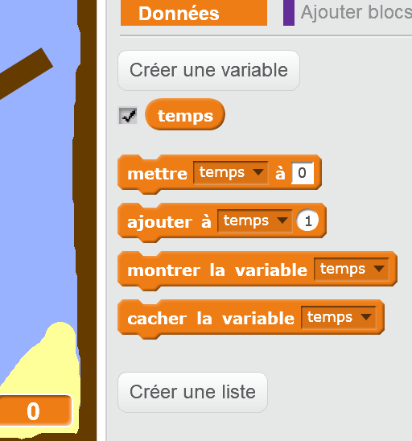
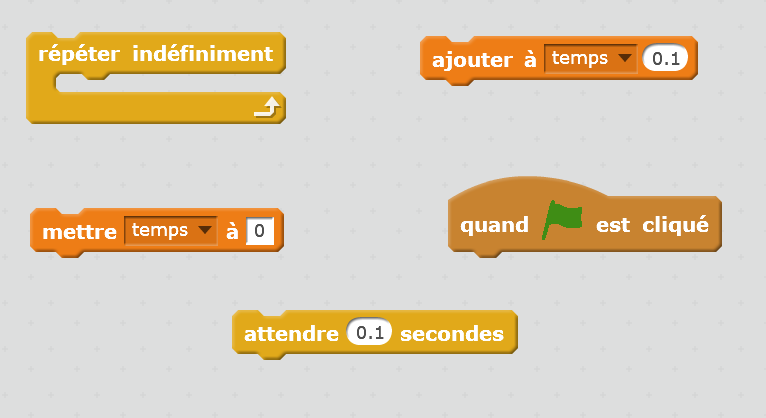
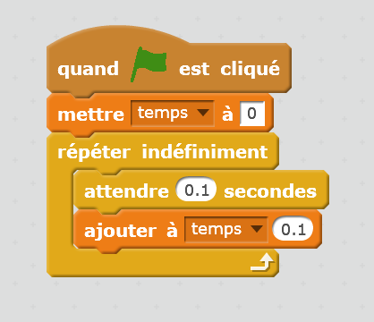
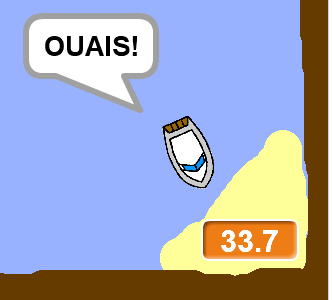

## Course contre la montre

Ajoutons un minuteur à votre jeu, pour que le joueur arrive à l’île déserte le plus rapidement possible.

\--- task \---

Ajoute une nouvelle variable appelée `temps` à ton scène. Tu peux aussi changer la présentation de votre nouvelle variable.

[[[generic-scratch-add-variable]]]

\--- /task \---

\--- task \---

Maintenant ajoute ce code à ton Scène pour que le minuteur compte jusqu’à le bateau atteigne l’île déserte.

\--- hints \--- \--- hint \--- Sur la Scène, `quand le drapeau vert est cliqué`, `mettre temps à 0`. Dedans ton bloc `indéfiniment`, tu dois d'abord `attendre 0,1s`, puis `modifier le temps pour 0,1`. \--- /hint \--- \--- hint \--- Voici les blocs de code dont tu auras besoin:  \--- /hint \--- \--- hint \--- Ton code devrait ressembler à ceci:  \--- /hint \--- \--- /hints \---

\--- /task \---

\--- task \---

Ça y est! Teste ton jeu et essaie d’aller le plus rapidement possible à l’île déserte!

\--- /task \---