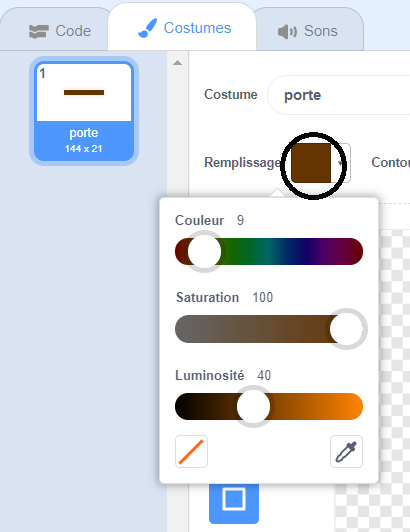

## Obstacles et difficulté

Pour le moment, le jeu est **beaucoup** trop facile, tu vas donc ajouter quelques éléments pour le rendre plus intéressant.

Tout d'abord, tu vas ajouter des boosters pour accélérer le bateau.

\--- task \---

Modifie ton fond de scène en ajoutant des flèches de boosters blanches.


\--- /task \---

\--- task \---

Ajoute maintenant plus de blocs de code à la boucle `répéter indéfiniment`{:class="block3control"} de ton bateau, de sorte que le sprite du bateau effectue trois pas supplémentaires lorsqu’il touche une flèche blanche.


```blocks3
si <touching color [#FFFFFF] ?> alors
avancer de (3) pas
fin
```

\--- /task \---

\--- task \---

Teste ton jeu pour voir si tes nouvelles flèches de booster accélèrent le bateau.

\--- /task \---

Tu vas ensuite ajouter une porte en rotation que le bateau doit éviter.

\--- task \---

Ajoute un nouveau sprite qui ressemble à ceci et appelle-le « porte » :


Assure-toi que la couleur du sprite de la porte est la même que celle des barrières en bois.



\--- /task \---

\--- task \---

Assure-toi que le centre du sprite de la porte est placé au milieu.


\--- /task \---

\--- task \---

Ajoute du code à ton sprite de porte pour le faire tourner lentement et pour toujours.

\--- hints \--- \--- hint \---

Ajoute des blocs de code au sprite de porte pour qu'il `tourne de 1 degré`{:class="block3motion"} `répéter indéfiniment`{:class="block3control"}.

\--- /hint \--- \--- hint \---

Voici les blocs de code dont tu as besoin :


```blocks3
répéter indéfiniment
fin

tourner cw (1) degrés

quand le drapeau est cliqué
```

\--- /hint \--- \--- hint \---

Voici à quoi devrait ressembler ton nouveau code :


```blocks3
lorsque le drapeau est cliqué
répéter indéfiniment
tourner cw (1) degré
fin
```

\--- /hint \--- \--- /hints \---

\--- /task \---

\--- task \---

Teste ton jeu à nouveau. Tu devrais maintenant avoir une porte tournante que le bateau devra éviter.


\--- /task \---