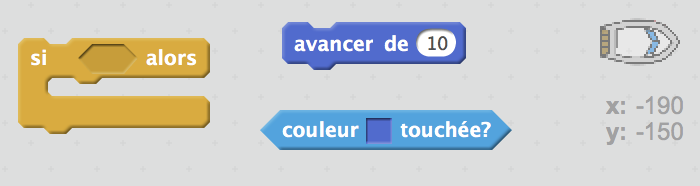
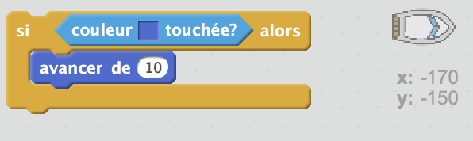
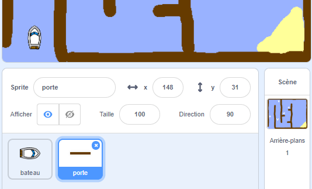
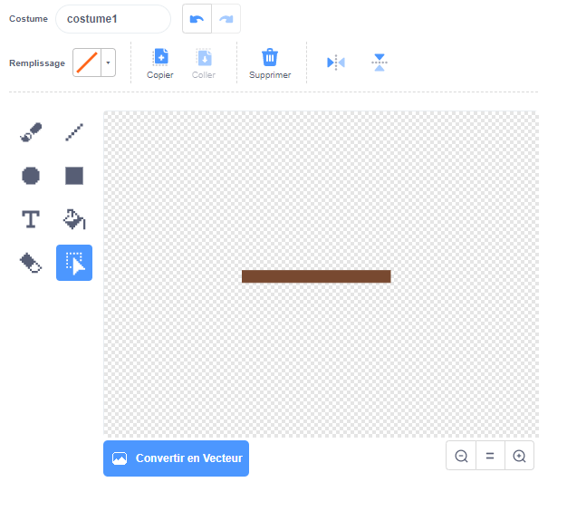
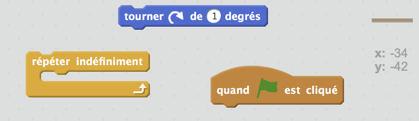
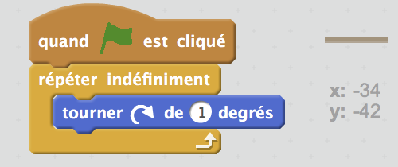
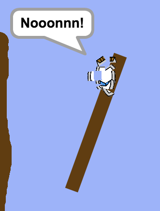

## Obstacles et puissances

Pour l'instant ce jeu est *trop* facile, ajoutons des choses pour le rendre plus intéressant.

\--- task \---

D’abord, ajoutons quelques 'zones d’accélération' à ton jeu qui accéléreront le bateau lorsqu’il les traversera. Modifie ton scène et ajoute quelques flèches blanches.

\--- /task \---

\--- task \---

Tu peux maintenant ajouter du code au bloc indéfiniement de ton bateau pour qu’il se déplace de trois pixels supplémentaires en touchant une flèche blanche.

\--- hints \--- \--- hint \--- `Si` ton bateau `touche une flèche blanche`, il doit `avancer 3 pas supplémentaires`.  
\--- /hint \--- \--- hint \--- Voici les blocs de code dont tu auras besoin:  \--- /hint \--- \--- hint \--- Ton code devrait ressembler à ceci:  \--- /hint \--- \--- /hints \---

\--- /task \---

\--- task \---

Tu peux aussi ajouter une porte tournante que ton bateau doit éviter. Ajoute un nouveau lutin appelé ‘porte’ qui ressemble à ceci :

Fais attention que la porte est de la même couleur que les autres barrières en bois.

\--- /task \---

\--- task \---

Définissez le centre du lutin ‘porte’.

\--- /task \---

\--- task \---

Ajoute le code à ton porte pour la faire tourner lentement indéfiniment.

\--- hints \--- \--- hint \--- Ajoute du code au lutin porte pour qu'elle `tourne à 1 degré` `indéfiniment`. \--- /hint \--- \--- hint \--- Voici les blocs de code dont tu auras besoin:  \--- /hint \--- \--- hint \--- Ton code devrait ressembler à ceci:  \--- /hint \--- \--- /hints \---

\--- /task \---

\--- task \---

Teste ton jeu. Tu devrais maintenant avoir une porte tournante que tu dois éviter.

\--- /task \---