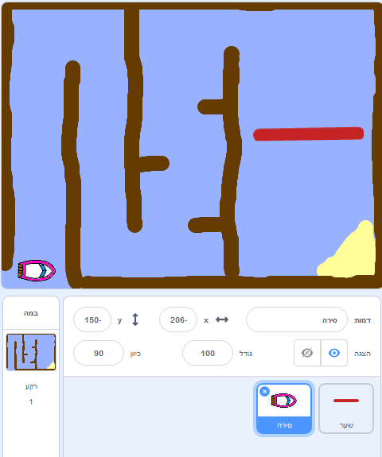

## מתחילים

\--- משימה \--- פתח את הפרויקט המתנע.

**באינטרנט:** פתח את פרויקט המתנע המקוון ב [rpf.io/boat-race-starter-on](http://rpf.io/boat-race-starter-on){: target = "_ _ blank"} ולחץ על **Remix**.

**מחובר:** הורד את הפרויקט Starter לא מקוון מ [rpf.io/p/en/boat-race-get](http://rpf.io/p/en/boat-race-get){: target = "_ _ ריק"}, ולאחר מכן לפתוח אותו באמצעות העורך מחובר.

אם אתה צריך להוריד ולהתקין את עורך Scratch לא מקוון, אתה יכול למצוא אותו ב [rpf.io/scratchoff](http://rpf.io/scratchoff). \--- / משימה \---

\--- task \---

הפרויקט כולל ספרייט הספינה, ואת מסלול מסלול מרוץ עם:

- עץ כי הספינה sprite יש להימנע
- אי מדברי שהסירה חייבת להגיע אליו
    
    

\--- /task \---