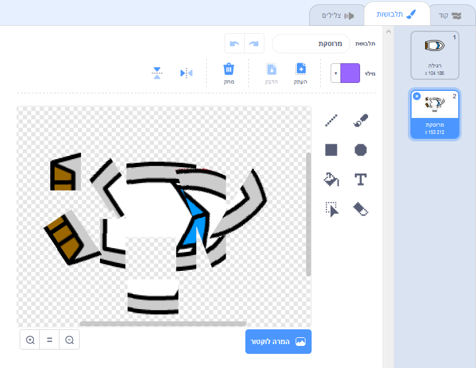
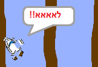

## התרסקות!

כרגע, הספינה הספינה יכול פשוט להפליג דרך מחסומי עץ! אתה עומד לתקן את זה עכשיו.

\--- task \---

אתה צריך שני תלבושות עבור ספרייט הספינה שלך: אחד תלבושות נורמלי, ואחד עבור כאשר הסירה קריסות. שכפל את התלבושת הספרייט של הספינה, ואת שם אחד תחפושת 'נורמלי' והשני 'מכה'.

\--- /task \---

\--- task \---

לחץ על התלבושת 'פגע' שלך, ולהשתמש בכלי **בחר** כדי לתפוס חתיכות של תחפושת ולנוע ולסובב אותם כדי להפוך את הסירה להיראות כאילו יש התרסק לרסיסים.



\--- /task \---

\--- task \---

עכשיו להוסיף קוד הסירה שלך, כך שהוא מתרסקת נשבר כאשר הוא נוגע כל מחסומי עץ חום.

\--- רמזים \--- \--- רמז \--- אתה צריך להוסיף בלוקים קוד בתוך `שלך לנצח`{: class = "block3control"} לולאה, כך הקוד שלך ממשיך לבדוק אם הספרייט הספינה התרסק, ו אם הוא התרסק, הקוד צריך לאפס את הספירה של הספינה.

``: class = "block3control"} הסירה היא `נוגעת`{: class = "block3sensing"} את הצבע החום של העץ, אתה צריך לעבור `לתלבושת פגע`{: class = "block3looks"} , `אומרים Noooo! עבור 2 שניות`{: class = "block3looks"}, ולאחר מכן `מתג חזרה תחפושת נורמלית`{: class = "block3looks"}. לבסוף, תצטרך `הצבע`{: class = "block3motion"} ו `ללכת למיקום ההתחלה`:: class = "block3motion"}.

\--- / רמז \--- \--- רמז \--- להלן בלוקים קוד שאתה צריך: 

```blocks3
אם <touching color [ ] ?> ואז
סוף

עבור x: (-190) y: (-150)

תלבושת לעבור (פגע v)

נקודת בכיוון (0)

תלבושת 

 כדי לעבור (רגיל v)

אומר [Noooooo!] עבור (2 שניות
```

\--- / רמז \--- \--- רמז \--- הנה מה את הקוד שלך צריך להיראות כמו: 

```blocks3
כאשר דגל לחץ על
נקודת כיוון) 0 (
עבור אל x)) -190 (y:) -150 (
לתמיד
אם <) מרחק ל (מצביע העכבר v)) > [5]> ולאחר מכן
לכיוון ( מצביע v)
(1) שלבים
בסוף
אם <touching color [#663b00] ?> ולאחר מכן
תחליף לתלבושת (v)
נניח [Noooooo!] עבור (2) שניות
תלבושת מתלבקת ל (רגילה)
נקודת כיוון (0)
עבור אל x: (-190) y: (-150)

```

\--- / hint \--- \--- / hints \---

\--- /task \---

\--- task \---

אתה צריך גם להוסיף קוד כדי לוודא את הספינה ספרייט תמיד מתחיל לצאת להסתכל "נורמלי".

בדוק שוב את הקוד שלך. אם אתה מנסה להפליג את הסירה דרך מחסום עץ עכשיו, הסירה צריכה לקרוס ולאחר מכן לנוע בחזרה למצב ההתחלה שלה.



\--- /task \---