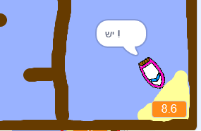

## הוספת טיימר

עכשיו תוסיף טיימר למשחק שלך, כך השחקן צריך להגיע לאי במהירות האפשרית.

\--- task \---

הוסף משתנה חדש הנקרא `שעה`{: class = "block3variables"} לשלב שלך.


[[[generic-scratch3-add-variable]]]

תוכל גם לבחור לחפש את הטיימר שלך על ידי שינוי אופן הצגת המשתנה החדש.

\--- /task \---

\--- task \---

עכשיו להוסיף בלוקים קוד הבמה שלך, כך טיימר סופרת עד הסירה מגיע אל האי.

\--- רמזים \--- \--- רמז \--- על הבמה, `כאשר הדגל הירוק נלחץ`{: class = "block3control"}, `להגדיר את הזמן ל 0`{: class = "block3variables "}. בפנים שלך `לנצח`{: class = "block3control"} הלולאה, תצטרך קודם `להמתין 0.1 שניות`{: class = "block3control"}, אז `השינוי בפעם ידי 0.1`{: class = "block3variables" }. \--- / רמז \--- \--- רמז \--- להלן בלוקים קוד תצטרך: 

```blocks3
(0.1)

כאשר דגל נלחץ

לנצח
סוף

לחכות (0.1) שניות

בחר [זמן v] ל [0]
```

\--- / רמז \--- \--- רמז \--- הנה מה את הקוד החדש צריך להיראות כמו: 

```blocks3
כאשר דגל לחץ
קבע [זמן] ל [0]
לנצח
לחכות (0.1) שניות
שינוי [זמן v] על ידי (0.1)
סוף
```

\--- / hint \--- \--- / hints \---

\--- /task \---

\--- task \---

לבדוק את המשחק שלך ולראות כמה מהר אתה יכול לקבל את הסירה אל האי!



\--- /task \---