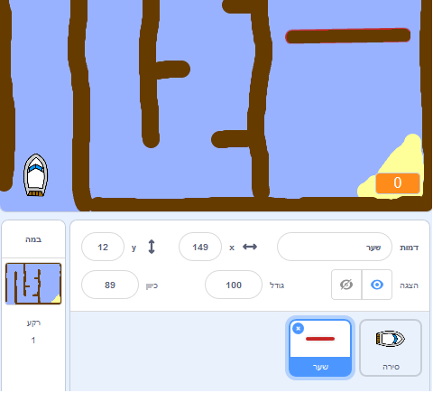
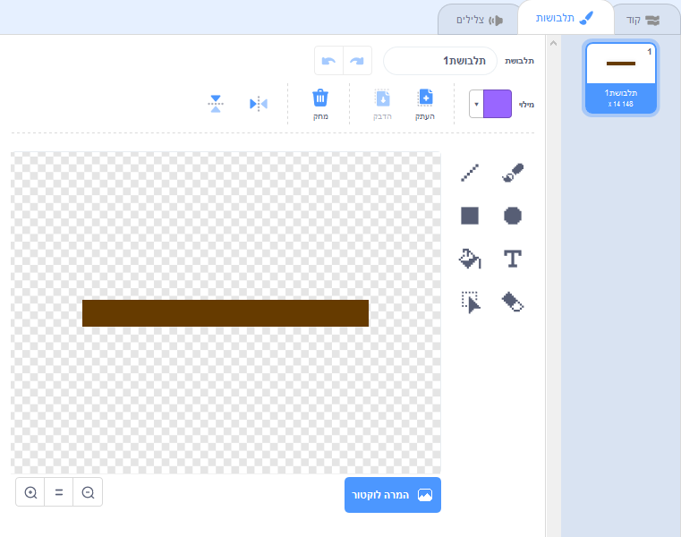
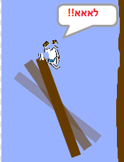

## מכשולים ומאיצים

עכשיו המשחק הוא **רחוק** קל מדי, כך תוכל להוסיף כמה דברים כדי לעשות את זה יותר מעניין.

ראשית, תוסיף כמה boosters כדי להאיץ את הסירה.

\--- task \---

עריכת רקע הבמה שלך על ידי הוספת כמה חיצים מגבר לבן.


\--- /task \---

\--- task \---

עכשיו להוסיף עוד קוביות קוד לסירה שלך `לנצח`:: class = "block3control"} לולאה כך הספרייט הספינה נע שלושה שלבים נוספים כאשר נוגע חץ לבן. 

```blocks3
אם <touching color [#FFFFFF] ?> ואז
להעביר (3) צעדים
סוף
```

\--- /task \---

\--- task \---

בדוק את המשחק שלך כדי לראות אם החצים החדשים שלך מאיץ להאיץ את הסירה.

\--- /task \---

לאחר מכן תוסיף שער מסתובב כי הסירה יש להימנע.

\--- task \---

הוסף שדון חדש שנראה כך וקרא לו 'שער':



ודא כי צבע של שדון השער זהה לצבע של מחסומי עץ.

\--- /task \---

\--- task \---

ודא כי במרכז שדון השער ממוקם באמצע.



\--- /task \---

\--- task \---

הוסף קוד לספרייט השער שלך כדי להפוך אותו לסובב לאט לנצח.

\--- רמזים \--- \--- רמז \--- להוסיף קטעי קוד כדי ספרייט השער כך שהוא `הופכת 1 תואר`{: class = "block3motion"} `לנצח`{: class = "block3control"} . \--- / רמז \--- \--- רמז \--- להלן בלוקים קוד שאתה צריך: 

```blocks3
לנצח
סוף

הפעל cw (1) מעלות

כאשר הדגל נלחץ
```

\--- / רמז \--- \--- רמז \--- הנה מה את הקוד החדש צריך להיראות כמו: 

```blocks3
כאשר דגל לחץ
לנצח
הפעל cw (1) מעלות
סוף
```

\--- / hint \--- \--- / hints \---

\--- /task \---

\--- task \---

בדוק את המשחק שלך שוב. עכשיו אתה צריך להיות שער מסתובב שאתה צריך לעורר את הסירה שלך מסביב.



\--- /task \---