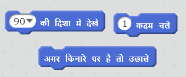

\--- challenge \---

## चुनौती: अधिक बाधाएँ!

क्या आप अपने गेम में और बाधाएँ जोड़ सकते हैं? यहाँ कुछ सुझाव हैं:

\--- task \---

आप अपने पृष्ठभूमि में हरा कीचड़(slime) जोड़ सकते हैं और खेल में बदलाव कर सकते हैं ताकि जब खिलाड़ी उसे छूएँ तो कीचड़ नाव को धीमा कर दे।

\--- hints \--- \--- hint \--- ऐसा करने के लिए आप `ठहरें` ब्लॉक का उपयोग कर सकते हैं: <1 /> \--- /hint \--- \--- /hints \---

\--- /task \---

\--- task \---

आप एक लट्ठा या एक शार्क की तरह गतिमान(चलता हुआ) चीज़ जोड़ सकते हैं!

\--- संकेत \--- \--- संकेत \--- ये ब्लॉक आपको अपनी नई चीज़ को चलाने में मदद कर सकते हैं:

यदि आपकी नई चीज़ भूरी(brown) नहीं है, तो आपको इसे अपने नाव कोड में शामिल करना होगा:

 \--- /hint \--- \--- /hints \---

\--- /task \---

\--- /challenge \---