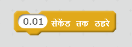

--- challenge ---

## चुनौती: अन्य रुकावटें!
क्या आप अपनी गेम में और रुकावटें शामिल कर सकते हैं? कुछ विचार इस प्रकार हैं:

+ आप अपने बैकड्रॉप में हरी स्लाइम जोड़ सकते हैं और गेम में बदलाव कर सकते हैं ताकि जब खिलाड़ी उसे छुए तो स्लाइम नाव को धीमा कर दे।

--- hints ---
--- hint ---
आप ऐसा करने के लिए `ठहरें` ब्लॉक का उपयोग कर सकते हैं:

--- /hint ---
--- /hints ---

+ आप एक लॉग या एक शार्क की तरह मूवी ऑब्जेक्ट जोड़ सकते हैं!

--- hints ---
--- hint ---
ये ब्लॉक आपको आपका नया ऑब्जेक्ट स्थानांतरित करने में सहायता कर सकते हैं:

यदि आपका नया ऑब्जेक्ट भूरा न हो, तो आपको आपके नौका के कोड में शामिल करना होगा:

--- /hint ---
--- /hints ---

--- /challenge ---
