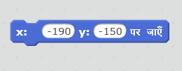
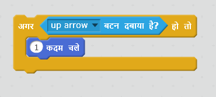

\--- challenge \---

## चुनौती: अधिक नौकाएं!

क्या आप अपने खेल को दो(2) खिलाड़ियों के बीच रेस में बदल सकते हैं? दूसरे खिलाड़ी को अपनी नाव का नियंत्रण ऊपर ऐरो (arrow) कुंजी से आगे बढ़ने के लिए और बाएँ और दाएँ ऐरो कुंजी(key of keyboard) से मोड़ने के लिए करना होगा।

\--- hints \--- \--- hint \--- नाव की प्रतिलिपि बनाएँ और नाव 2 के रंग को बदलें।

 \--- /hint \--- \--- hint \--- इस कोड को बदलकर दो नावों को भिन्न-भिन्न स्थानों से शुरू करें:

 \--- /hint \--- \--- hint \--- नाव 2 का कोड डिलीट करें जो माउस का उपयोग करता है और ऐरो बटन द्वारा नौका 2 को नियंत्रित करने के कोड से बदलें। \--- /hint \--- \--- hint \--- यह वह कोड है जो आपको नाव 2 को आगे बढ़ाने के लिए चाहिए होगा:

 \--- /hint \--- \--- hint \--- दायाँ और बायाँ बटन दबाने पर आपको नाव को *मोड़ने* के लिए कोड भी चाहिए होगा। \--- /hint \--- \--- /hints \---

\--- /challenge \---