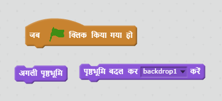

 [Offline Completed Project](resources/BoatRace-Finished.sb2){:download='BoatRace-Finished.sb2'}
 [Online Completed Project](http://scratch.mit.edu/projects/63957956/#editor){:target="_blank"}

\--- challenge \---

## चुनौती: अधिक स्तर(more levels)!

क्या आप और पृष्ठभूमि(backdrop) बना सकते हैं और खिलाड़ी को स्तरों(levels) के बीच चयन करने की अनुमति दें सकते है?

\--- hints \--- \--- hint \---  \--- /hint \--- \--- /hints \---

\--- /challenge \---