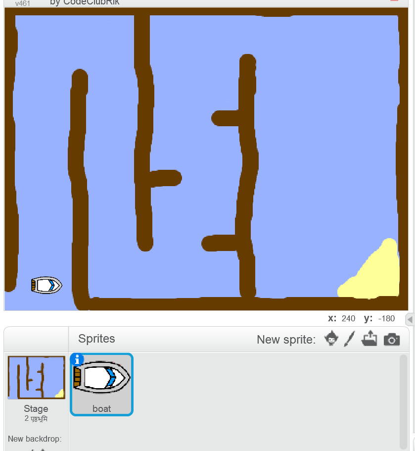

## आरम्भ करना

\--- task \---

प्रारम्भिक(starter) प्रोजेक्ट खोलें ।

## \--- collapse \---

title: मैं स्क्रैच का उपयोग ऑनलाइन कर रहा हूँ

## image: images/image.png

[jumpto.cc/boat-go](https://scratch.mit.edu/projects/63958014/#editor){:target="_blank"}. \--- /collapse \--- पर 'नौका रेस' Scratch का प्रारम्भिक प्रोजेक्ट खोलें। \--- /collapse \---

## \--- collapse \---

title: मैं स्क्रैच का उपयोग ऑफ़लाइन कर रहा हूँ

## image: images/image.png

[jumpto.cc/boat-get](http:jumpto.cc/boat-get){:target="_blank"} पर 'नौका रेस' Scratch का प्रारम्भिक प्रोजेक्ट डाउनलोड करें और इसे ऑफ़लाइन एडिटर द्वारा खोलें। \--- /collapse \---

\--- /task \---

\--- task \---

नौका स्प्राइट और कोर्स पृष्ठभूमि(backdrop) प्रोजेक्ट के साथ शामिल हैं:

- लकड़ी जिससे आपको नाव को बचाना है
- एक रेगिस्तान द्वीप है जहाँ आपको नाव पहुँचाना है।
    
    

\--- /task \---