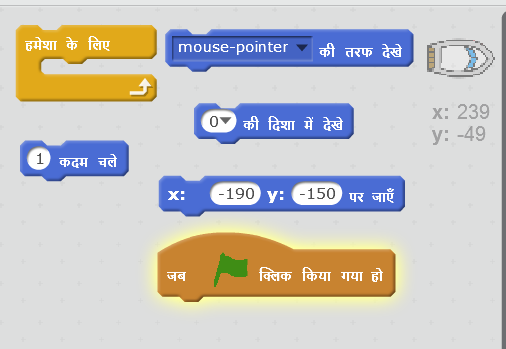
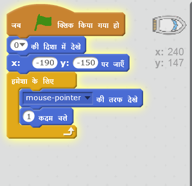
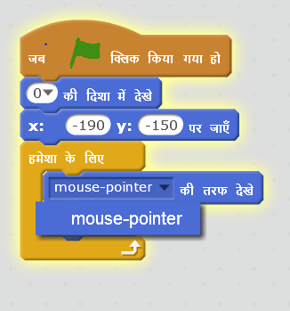
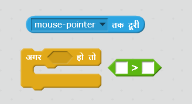
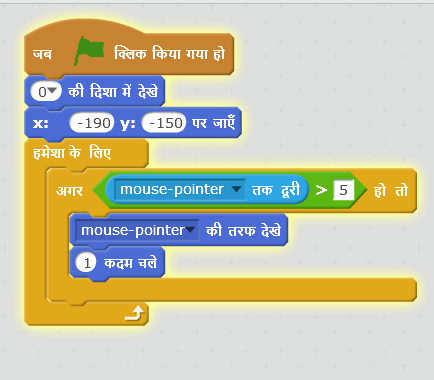

## नाव को नियंत्रित करना

\--- task \---

आप अपने माउस से नाव को नियंत्रित करने जा रहे हैं। अपनी नाव में कोड जोड़ें ताकि यह नीचे बाएँ कोने में उपर की ओर होकर स्टार्ट हो और फिर माउस पॉइंटर का पीछे करें। सुनिश्चित करने के लिए **अपने कोड का परीक्षण करें** कि यह अपेक्षाकृत कार्य करता है या नहीं।

\--- hints \--- \--- hint \--- एक बार जब `हरा झंडा क्लिक किया जाएगा, आपको अपनी नौका को आरंभिक स्थिति में
 ला के ऊपर की ओर मुँह करना होगा। इसके बाद इसे <code>माउस पॉइंटर की तरफ इंगित` करने की आवश्यकता होगी और `1 कदम चलना` होगा। इसे यह `हमेशा` दोहराना होगा।

\--- /hint \--- \--- hint \--- ये वे कोड ब्लॉक हैं, जिनकी आपको आवश्यकता होगी:  \--- /hint \--- \--- hint \--- आपका कोड इस प्रकार दखाई देगा:  \--- /hint \--- \--- /hints \---

\--- /task \---

\--- task \---

फ्लैग पर क्लिक करके और माउस को हिला कर अपनी नाव का परीक्षण करें। क्या नाव माउस की दिशा में बढ़ती है?

## \--- collapse \---

title: यदि आप समस्या हो ...

## image: images/image.png

**नोट:**: Scratch में अभी कोई त्रुटी है जिसका अर्थ यह हो सकता है की आपकी नाव माउस के पॉइंटर की दिशा में न बढ़े। यदि ऐसा होता है, तो ब्लॉक की `ओर के पॉइंट` पर क्लिक करें और `माउस पॉइंटर` का पुन: चयन करें।

 \--- /collapse \---

\--- /task \---

\--- task \---

यदि नौका माउस के पॉइंटर तक पहुँच जाए तो क्या होगा? कोशिश करें।

\--- /task \---

\--- task \---

ऐसा होने से रोकने के लिए, आपको अपने कोड में एक `यदि(if)` ब्लॉक शामिल करना होगा, ताकि नौका केवल तभी स्थानांतरित हो जब यह माउस से 5 पिक्सल से अधिक दूरी पर हो।

\--- hints \--- \--- hint \--- नाव का मुँह केवल माउस के पॉइंटर की ओर होना चाहिए और इसे स्थानांतरित तभी होना चाहिए `यदि` `माउस पॉइंटर से दूरी 5 पिक्सल से अधिक हो`। \--- /hint \--- \--- hint \--- ये वे कोड ब्लॉक हैं, जिनकी आपको नाव में जोड़ने की आवश्यकता होगी:  \--- /hint \--- \--- hint \--- आपका कोड इस प्रकार दखाई देगा:  \--- /hint \--- \--- /hints \---

\--- /task \---

\--- task \---

अपनी नाव का पुन: परीक्षण करें ताकि यह पता लग सके कि समस्या हल हो गई है या नहीं।

\--- /task \---