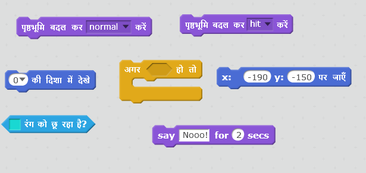
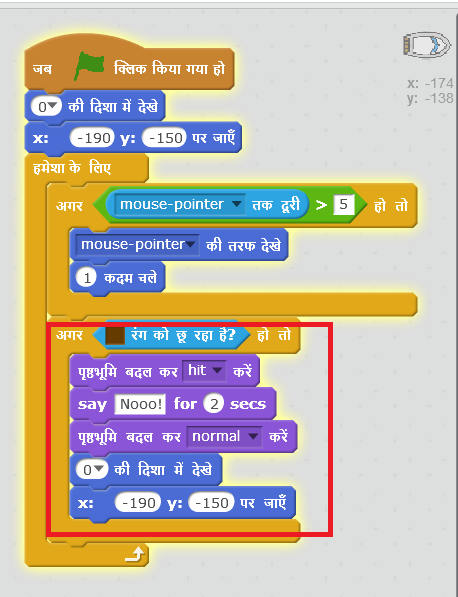
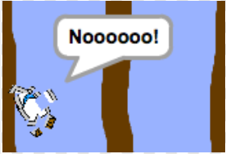

## दुर्घटनाग्रस्त होना!

इस समय, आपकी नाव लकड़ी की बाधाओं से गुज़र सकती है! आइए इसे ठीक करें।

\--- task \---

आपको अपनी नाव के लिए दो पोशाक की आवश्यकता होगी, एक साधारण पोशाक, और दूसरी उस समय के लिए जब नाव की टक्कर हो जाती है। अपनी नाव की पोशाक की प्रतिलिपि(duplicate) बनाएं, और एक को 'normal' नाम दें और दूसरे को 'hit' नाम दें।

\--- /task \---

\--- task \---

अपने 'hit' पोशाक पर क्लिक करें, और नाव के टुकड़े को पकड़ने के लिए select टूल का चयन करें और उन्हें इधर-उधर हटाए ताकि देखने में यह दुर्घटनाग्रस्त जैसा लगे।

\--- /task \---

\--- task \---

अब अपनी नाव में कोड जोड़ें ताकि यह किसी भी भूरी(brown) लकड़ी के टुकड़े से टकराने पर दुर्घटनाग्रस्त हो जाए और टूट जाए।

\--- hints \--- \--- hint \--- आपको अपने `हमेशा के लिए` लूप के अंदर कोड जोड़ने की आवश्यकता है ताकि आपका कोड जाँचता रहे कि नाव दुर्घटनाग्रस्त हुई है या नहीं। `अगर` नाव भूरे रंग की लकड़ी को `छूती` है, तो आपको `hit costume बदलने`की जरूरत होगी, `Noooo! कहना होगा 2 सेकंड के लिए`, और फिर `सामान्य पोशाक पर वापस आ जाना ` होगा। अंततः, आपको `ऊपर की ओर मुँह` करना होगा और ` प्रारम्भ की स्थिति` पर आना होगा। \--- /hint \--- \--- hint \--- ये वे कोड ब्लॉक हैं, जिनकी आपको आवश्यकता होगी:  \--- /hint \--- \--- hint \--- आपका कोड इस प्रकार दखाई देगा:  \--- /hint \--- \--- /hints \---

\--- /task \---

\--- task \---

आपको यह भी सुनिश्चित करना होगा कि आपकी नाव हमेशा 'सामान्य(normal)' स्थिति में स्टार्ट हो।

यदि अब आप लकड़ी के बाधा(barrier) में से गुज़रने का प्रयास करते है तो, आप देखेंगे कि आपकी नाव दुर्घटनाग्रस्त हो जाती है और प्रारम्भ स्थिति में लौट आती है।

\--- /task \---