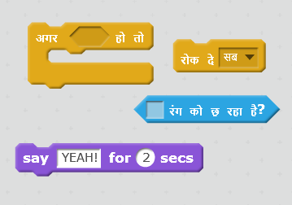
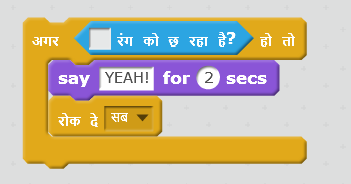

## चुनौती: जीतना!

क्या आप अपने बोट कोड में एक अन्य `अगर` वचन जोड़ सकते हैं ताकि खिलाड़ी रेगिस्तान द्वीप पर पहुँचने पर जीत जाए?

जब नाव पीले रेगिस्तान द्वीप पर पहुँचे तो गेम को 'YEAH!' कहना चाहिए! और फिर इसे रुक जाना चाहिए।

\--- hints \--- \--- hint \--- आपको अपने `हमेशा के लिए(forever)` लूप के अंदर अधिक कोड जोड़ने की आवश्यकता है ताकि आपका कोड जाँचता रहे कि खिलाड़ी जीता या नहीं। `यदि` नाव खजाने के द्वीप को `छू` लेती है, तो आपको `2 सेकंड के लिए 'YEAH!' बोलना` होगा और फिर गेम समाप्त करने के लिए `सब रोकना` होगा। \--- /hint \--- \--- hint \--- ये वे कोड ब्लॉक हैं, जिनकी आपको आवश्यकता होगी:  \--- /hint \--- \--- hint \--- आपका कोड इस प्रकार दखाई देगा: 

यह न भूलें कि नया कोड आपके `हमेशा के लिए` लूप के अंदर होना चाहिए। \--- /hint \--- \--- /hints \---