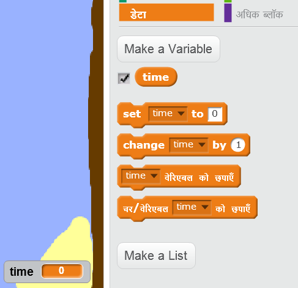
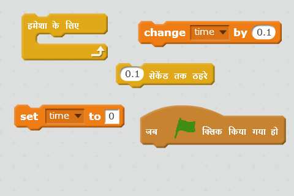
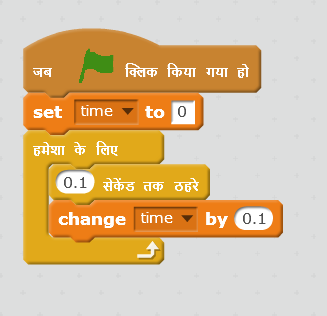

## टाइम ट्रायल (Time trial)

चलिए अपने खेल में टाइमर जोड़े, ताकि खिलाड़ी को जितनी जल्दी हो सके रेगिस्तान द्वीप पर जाना पड़े।

\--- task \---

अपने स्टेज में `time` नामक एक नया वेरिएबल जोड़ें। आप अपने नए वेरिएबल के डिस्प्ले को भी बदल सकते हैं।

[[[generic-scratch-add-variable]]]

\--- /task \---

\--- task \---

अब अपने स्टेज में कोड जोड़ें ताकि टाइमर नाव के रेगिस्तानीय द्वीप पर पहुँच जाने तक समय गिनता रहे।

\--- hints \--- \--- hint \--- स्टेज पर, `जब हरे रंग का झंडा क्लिक किया जाए`, तो `समय को 0 पर सेट हो जाए`। अपने `हमेशा के लिए` ब्लॉक के अंदर, आपको पहले `0.1 सेकंड इंतजार` करना होगा, फिर ` समय 0.1 बदलना` होगा। \--- /hint \--- \--- hint \--- ये वे कोड ब्लॉक हैं, जिनकी आपको आवश्यकता होगी:  \--- /hint \--- \--- hint \--- आपका कोड इस प्रकार दखाई देगा:  \--- /hint \--- \--- /hints \---

\--- /task \---

\--- task \---

बस इतना ही! अपनी गेम का परीक्षण करें और देखें कि आप कितनी जल्द रेगिस्तान द्वीप पर पहुँच सकते हैं!

\--- /task \---