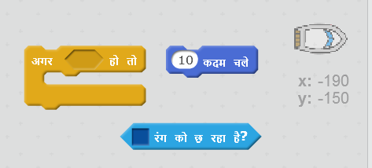
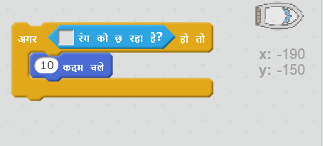
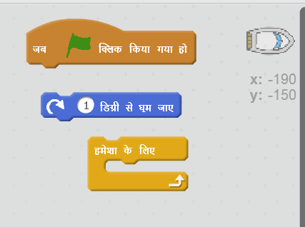
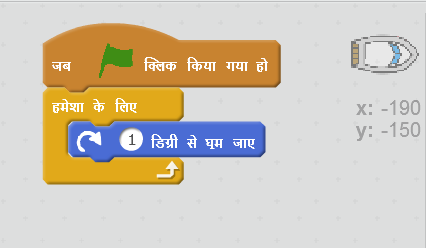

## बाधाएँ और पावर-बढ़ाना (Obstacles and power-ups)

इस समय गेम *बहुत* आसान है – चलिए इसे और दिलचस्प बनाने के लिए इसमें चीज़ें जोड़ें।

\--- task \---

चलिए पहले अपनी नाव को तेज़ करने के लिए खेल में कुछ 'बूस्ट' जोड़े। अपने स्टेज के पृष्ठभूमि(backdrop) को सम्पादित(edit) करें और कुछ सफेद तीर निशान के बूस्टर जोड़ें।

\--- /task \---

\--- task \---

अब अपनी नाव के 'हमेशा के लिए(forever)' लूप में कुछ कोड जोड़ें ताकि जब यह सफेद बूस्टर को छुए तो यह तीन अतिरिक्त कदम तक स्थानांतरित हो जाए।

\--- hints \--- \--- hint \--- `अगर` आपकी नाव `सफेद बूस्टर को छूती है` तो, तो इसे `3 अतिरिक्त कदम` चलना चाहिए।  
\--- /hint \--- \--- hint \--- ये वे कोड ब्लॉक हैं, जिनकी आपको आवश्यकता होगी:  \--- /hint \--- \--- hint \--- आपका कोड इस प्रकार दखाई देगा:  \--- /hint \--- \--- /hints \---

\--- /task \---

\--- task \---

आप एक घूमने वाला गेट भी जोड़ सकते हैं जिससे आपकी नाव को बचना होगा। ''गेट(gate)' नामक एक नई स्प्राइट जोड़ें जो इस प्रकार दिखाई देता है:

सुनिश्चित करें कि गेट का रंग लकड़ियों के बाधा(barrier) के समान हो।

\--- /task \---

\--- task \---

गेट स्प्राइट का केंद्र सेट करें।

\--- /task \---

\--- task \---

अपने गेट को हमेशा धीरे-धीरे घूमने के लिए इसमें कोड जोड़ें।

\--- hints \--- \--- hint \--- गेट स्प्राइट में कोड जोड़ें ताकि यह `1 डिग्री घूमे ``हमेशा के लिए(forever)`। \--- /hint \--- \--- hint \--- ये वे कोड ब्लॉक हैं, जिनकी आपको आवश्यकता होगी:  \--- /hint \--- \--- hint \--- आपका कोड इस प्रकार दखाई देगा:  \--- /hint \--- \--- /hints \---

\--- /task \---

\--- task \---

अपने गेम का परीक्षण करें। अब आपके पास एक घूमने वाला गेट होना चाहिए जिससे आपको बचना होगा।

\--- /task \---