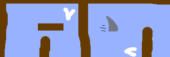

## चुनौती: अपने गेम में सुधार करें

- क्या आप अपने खेल में और अधिक बाधाएँ जोड़ सकते हैं? उदाहरण के लिए, आप अपनी पृष्ठभूमि में हरे रंग की कीचड़ को जोड़ सकते हैं और कोड में बदलाव कर सकते हैं, ताकि खिलाड़ी को छूने की अनुमति देने पर कीचड़ नाव को धीमा कर दे।

- आप एक चलती हुई बाधा जोड़ सकते हैं, उदाहरण के लिए एक लट्ठा या शार्क!

- क्या आप अपने खेल को दो खिलाड़ियों के बीच की दौड़ में बदल सकते हैं? दूसरे खिलाड़ी को आगे बढ़ने के लिए ऊपर तीर और मुड़ने के लिए बाएँ और दाएँ तीर कुंजियों का उपयोग करके अपनी नाव को नियंत्रित करने की आवश्यकता होगी।

- क्या आप विभिन्न पृष्ठभूमियों को जोड़कर अधिक स्तर बना सकते हैं, और क्या आप खिलाड़ी को स्तरों के बीच चयन करने की अनुमति दे सकते हैं?