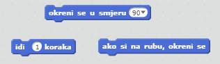
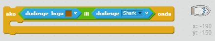

\--- challenge \---

## Izazov: više prepreka!

Možeš li svojoj igri dodati još prepreka? Evo nekoliko ideja:

\--- task \---

Možeš dodati zelenu sluz na pozadinu koja će usporiti brod kad ju dodirne.

\--- hints \--- \--- hint \--- Možeš koristiti naredbu `Čekaj` da bi napravio sljedeće:  \--- /hint \--- \--- /hints \---

\--- /task \---

\--- task \---

Možeš dodati objekte koji se kreću, npr. kladu ili morskog psa!

\--- hints \--- \--- hint \--- These blocks may help you move your new object:

If your new object isn't brown, you'll need to add to your boat code:

 \--- /hint \--- \--- /hints \---

\--- /task \---

\--- /challenge \---