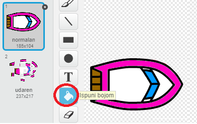
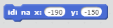
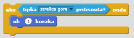

\--- challenge \---

## \--- challenge \---više brodova!

Možeš li napraviti da se u igri utrkuju 2 igrača? Drugi igrač će upravljati brodom koristeći strelicu prema gore za kretanje naprijed, a lijevu i desnu za skretanje.

\--- hints \--- \--- hint \--- Kopiraj brod i promijeni boju drugom brodu.

 \--- /hint \--- \--- hint \--- Mijenjanjem ovog koda, dva broda će kretati s različitih pozicija:

 \--- /hint \--- \--- hint \--- Izbriši kod za brod2 koji koristi miš za upravljanje i zamijeni ga kodom tako da se brod2 upravlja strelicama. \--- /hint \--- \--- hint \--- Ovim kodom ćeš brod2 pomicati naprijed:

 \--- /hint \--- \--- hint \--- Potreban je i kod za *skretanje* broda kad su pritisnute lijeva i desna strelica. \--- /hint \--- \--- /hints \---

\--- /challenge \---