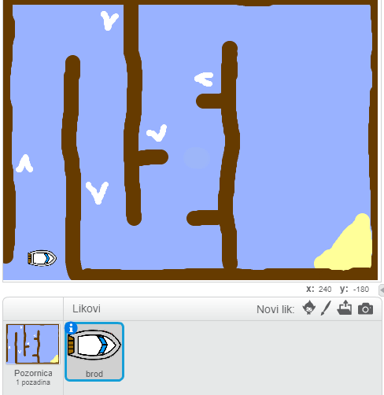

## Getting started

\--- task \---

Open the starter project.

## \--- collapse \---

title: Koristim Scratch online

## image: images/image.png

Open the 'Boat Race' Scratch starter project at [jumpto.cc/boat-go](https://scratch.mit.edu/projects/63958014/#editor){:target="_blank"}. \--- /collapse \---

## \--- collapse \---

title: Koristim Scratch offline

## image: images/image.png

Download the 'Boat Race' Scratch starter project from [jumpto.cc/boat-get](http:jumpto.cc/boat-get){:target="_blank"} and then open it using the offline editor. \--- /collapse \---

\--- /task \---

\--- task \---

The project includes a boat sprite and a course backdrop with:

- Drvo koje brod mora izbjegavati
- Pusti otok na koji brod treba stići
    
    

\--- /task \---