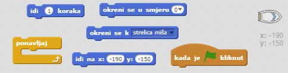
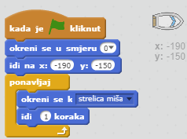
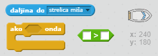
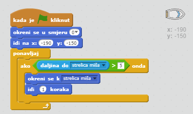

## Upravljanje brodom

\--- task \---

Brodom ćeš upravljati pomoću miša. Dodaj naredbe svom brodu tako da krene iz donjeg lijevog kuta okrenut prema gore i slijedi pokazivač miša. **Testiraj svoj kod** kako bi se uvjerio da radi ono što bi trebao.

\--- hints \--- \--- hint \--- Kad je `kliknuta zelena zastavica`, tvoj brod treba `otići na početnu poziciju` i `okrenuti se prema gore`. Zatim treba `biti okrenut prema pokazivaču miša` i `pomaknuti se za 1 korak`. Ovo treba ponavljati `zauvijek`.

\--- /hint \--- \--- hint \--- Trebat ćeš ove blokove naredbi:  \--- /hint \--- \--- hint \--- Tvoj kod treba izgledati ovako:  \--- /hint \--- \--- /hints \---

\--- /task \---

\--- task \---

Klikom na zastavicu i pomicanjem miša testiraj svoj brod. Plovi li brod prema pokazivaču miša?

## \--- collapse \---

title: Ako imaš problema...

## image: images/image.png

**Napomena:** U Scratchu je trenutno pogreška i tvoj brod se možda neće pomicati prema pokazivaču miša. Ako se ovo dogodi, klikni strelicu u bloku `okreni se prema naprijed` i ponovno odaberi `pokazivač miša`.

 \--- /collapse \---

\--- /task \---

\--- task \---

Što će se dogoditi ako brod dođe do strelice miša? Isprobaj.

\--- /task \---

\--- task \---

To stop this from happening, you'll need to add an `if` block to your code, so that the boat only moves if it is more than 5 pixels away from the mouse.

\--- hints \--- \--- hint \--- The boat should only point towards the mouse pointer and move `if` the `distance to the mouse pointer` is `greater than 5 pixels`. \--- /hint \--- \--- hint \--- Here are the code blocks you'll need to add to the code for the boat:  \--- /hint \--- \--- hint \--- This is what your code should look like:  \--- /hint \--- \--- /hints \---

\--- /task \---

\--- task \---

Ponovno isprobaj svoj brod i provjeri je li problem riješen.

\--- /task \---