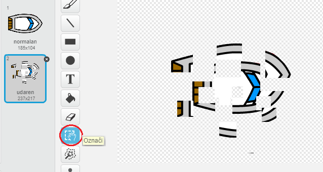
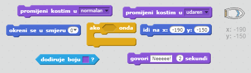
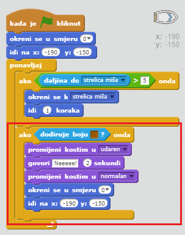
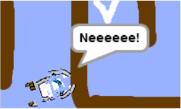

## Sudaranje!

Trenutno, tvoj brod može ploviti kroz drvene prepreke. Popravimo to.

\--- task \---

You'll need two costumes for your boat, one normal costume, and one for when the boat crashes. Duplicate your boat costume, and name one costume 'normal' and the other 'hit'.

\--- /task \---

\--- task \---

Click on your 'hit' costume, and choose the Select tool to grab bits of the boat and move and rotate them around to make it look as if it's crashed.

\--- /task \---

\--- task \---

Now add code to your boat so that it crashes and breaks up when it touches any brown wooden bits.

\--- hints \--- \--- hint \--- You need to add code inside your `forever` loop so that your code keeps checking if the boat has crashed. `If` the boat is `touching` the brown colour of the wood, you need to `switch to the hit costume`, `say Noooo! for 2 seconds`, and then `switch back to the normal costume`. Finally, you'll need to `point up` and `go to the start position`. \--- /hint \--- \--- hint \--- Here are the code blocks you'll need:  \--- /hint \--- \--- hint \--- Here's what your code should look like:  \--- /hint \--- \--- /hints \---

\--- /task \---

\--- task \---

You should also make sure that your boat always starts out looking 'normal'.

If you try to sail through a wooden barrier now, you should see that your boat crashes and moves back to the start.

\--- /task \---