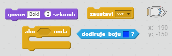
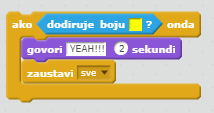

## \--- challenge \---pobjeda!

Možeš li brodu dodati još jednu naredbu `ako...onda` tako da igrač pobijedi kada stigne do pustog otoka?

Kada brod stigne do žutog pustog otoka, trebao bi reći 'TOOOO!' i stati.

\--- hints \--- \--- hint \--- Dodaj još naredbi unutar petlje `ponavljaj` kojima se provjerava je li igrač pobijedio. `If` the boat is `touching` the colour of the treasure island, you need to `say 'YEAH!' for 2 seconds` and then `stop all` to end the game. \--- /hint \--- \--- hint \--- Here are the code blocks you'll need:  \--- /hint \--- \--- hint \--- Here's what your code should look like: 

Don't forget that the new code needs to be inside your `forever` loop. \--- /hint \--- \--- /hints \---