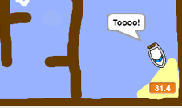

## Dodavanje mjerača vremena

Now you will add a timer to your game, so that the player has to get to the island as quickly as possible.

\--- task \---

Add a new variable called `time`{:class="block3variables"} to your Stage.


[[[generic-scratch3-add-variable]]]

You can also choose a look for your timer by changing how your new variable is displayed.

\--- /task \---

\--- task \---

Now add code blocks to your Stage so that the timer counts up until the boat reaches the island.

\--- hints \--- \--- hint \--- On the Stage, `when the green flag is clicked`{:class="block3control"}, `set the time to 0`{:class="block3variables"}. Inside your `forever`{:class="block3control"} loop, you'll need to first `wait 0.1 secs`{:class="block3control"}, then `change the time by 0.1`{:class="block3variables"}. \--- /hint \--- \--- hint \--- Here are the code blocks you'll need: 

```blocks3
change [time v] by (0.1)

when flag clicked

forever
end

wait (0.1) seconds

set [time v] to [0]
```

\--- /hint \--- \--- hint \--- Here's what your new code should look like: 

```blocks3
when flag clicked
set [time v] to [0]
forever
wait (0.1) seconds
change [time v] by (0.1)
end
```

\--- /hint \--- \--- /hints \---

\--- /task \---

\--- task \---

Test out your game and see how quickly you can get the boat to the island!



\--- /task \---