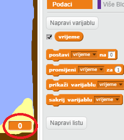
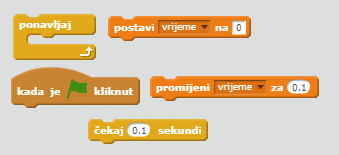
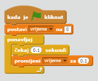

## Time trial

Let's add a timer to your game, so that the player has to get to the desert island as quickly as possible.

\--- task \---

Dodaj novu varijablu `vrijeme` na svoju pozornicu. Možeš promijeniti i prikaz nove varijable.

[[[generic-scratch-add-variable]]]

\--- /task \---

\--- task \---

Sada dodaj naredbe na pozornicu tako da brojač odbrojava vrijeme dok brod ne stigne do pustog otoka.

\--- hints \--- \--- hint \--- Na pozornici, `kada je zelena zastavica kliknuta`, `postavi vrijeme na 0`. Inside your `forever` block, you'll need to first `wait 0.1 secs`, then `change the time by 0.1`. \--- /hint \--- \--- hint \--- Here are the code blocks you'll need:  \--- /hint \--- \--- hint \--- Here's what your code should look like:  \--- /hint \--- \--- /hints \---

\--- /task \---

\--- task \---

That's it! Test out your game and see how quickly you can get to the desert island!

\--- /task \---