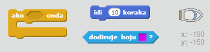
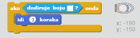
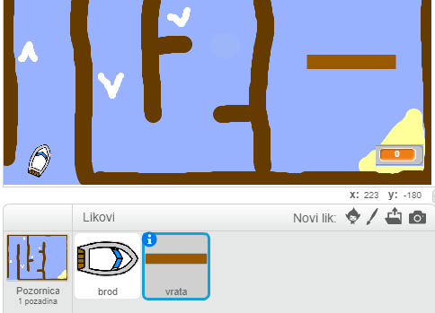
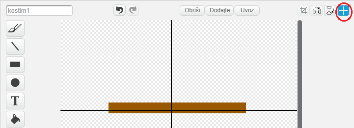
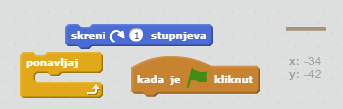
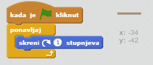
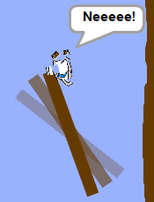

## Pepreke

Trenutno je ova igra *jako* jednostavna - učinimo je zanimljivijom.

\--- task \---

Dodajmo "pojačanje" igrici koje će ubrzati brod. Dodaj nekoliko bijelih strelica na pozadinu.

\--- /task \---

\--- task \---

Dodaj naredbe u petlju ponavljaj tako da se brod pomakne 3 dodatna koraka kada dodirne bijelu strelicu.

\--- hints \--- \--- hint \--- `Ako` tvoj brod `dira bijelu strelicu`, treba se `pomaknuti 3 dodatna koraka`.  
\--- /hint \--- \--- hint \--- Trebat ćeš sljedeće naredbe:  \--- /hint \--- \--- hint \--- Tvoj kod treba izgledati ovako:  \--- /hint \--- \--- /hints \---

\--- /task \---

\--- task \---

Možeš dodati i rotirajuća vrata koja brod treba izbjegavati. Dodaj novi lik "vrata" koji izgleda ovako:

Boja vrata mora biti jednaka boji drvenih prepreka.

\--- /task \---

\--- task \---

Centriraj vrata.

\--- /task \---

\--- task \---

Dodaj naredbe vratima da se neprestano polako vrte.

\--- hints \--- \--- hint \--- Dodaj naredbe liku vrata tako se t `okrene za 1 stupanj` `zauvijek`. \--- /hint \--- \--- hint \--- Trebat ćeš sljedeće naredbe:  \--- /hint \--- \--- hint \--- Tvoj kod treba izgledati ovako:  \--- /hint \--- \--- /hints \---

\--- /task \---

\--- task \---

Isprobaj svoju igru. Sada bi trebalo izbjegavati i vrata koja se okreću.

\--- /task \---