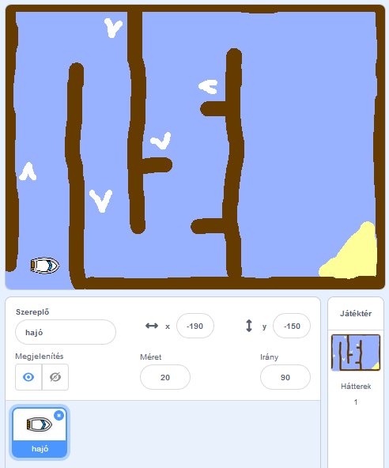

## Elkezdeni

\--- feladat \---

Nyissa meg az indító projektet.

## \--- összeomlás \---

cím: Scratch-ot használok online

## kép: images / image.png

Nyissa meg a "Boat Race" Scratch starter projektet a [jumpto.cc/boat-go](https://scratch.mit.edu/projects/63958014/#editor){: target = "_ blank"} programmal. \--- / összeomlás \---

## \--- összeomlás \---

title: A Scratch offline használatát használom

## kép: images / image.png

Töltse le a "Boat Race" Scratch starter projektet a [jumpto.cc/boat-get](http:jumpto.cc/boat-get){: target = "_ blank"} programból, majd nyissa meg az offline szerkesztő segítségével. \--- / összeomlás \---

\--- / feladat \---

\--- feladat \---

A projekt magában foglalja a hajó sprite és egy tanfolyam hátteret a következőkkel:

- Fa, amit a hajónak el kell kerülnie
- A sivatagi sziget, ahová a hajónak el kell jutnia
    
    

\--- / feladat \---