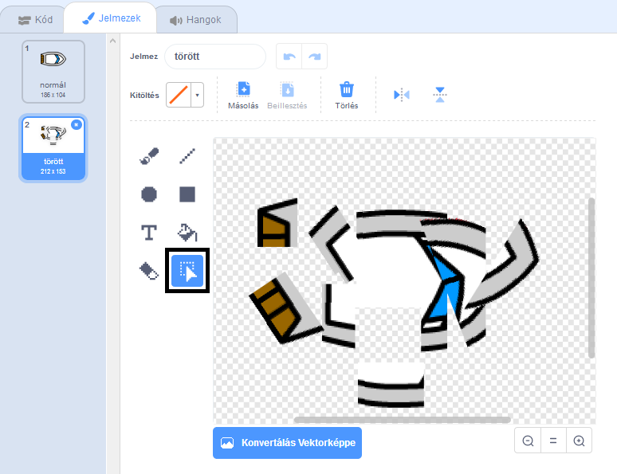
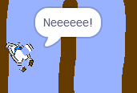

## Összeomlik!

Jelenleg a hajó sprite egyszerűen vitorlázhat a fából készült korlátokon! Most meg fogod javítani.

\--- feladat \---

Szükséged van két jelmezre a hajó sprite-jére: egy normál ruha, és az egyik, amikor a hajó összeomlik. Ismételje meg a hajó sprite jelmezét, és adjon nevet egy „normál” jelmeznek és a másik „hitnek”.

\--- / feladat \---

\--- feladat \---

Kattintson a "hit" jelmezre, és használja a **Select** eszközt, hogy megragadja a jelmezeket, és mozgassa és elforgassa őket, hogy a hajó úgy nézzen ki, mintha összetört volna.



\--- / feladat \---

\--- feladat \---

Most adjon hozzá kódot a hajójához, hogy összeomoljon és felszakadjon, amikor megérinti a barna fa akadályokat.

\--- hints \--- \--- hint \--- Kódblokkokat kell hozzáadnia a `forever`{: class = "block3control"} hurokhoz úgy, hogy a kódja ellenőrizze, hogy a hajó sprite összeomlott-e, és ha összeomlott, a kódnak vissza kell állítania a hajó sprite pozícióját.

`ha`{: class = "block3control"} a hajó `megérintette a`{: class = "block3sensing"} a fa barna színét, akkor `váltania a hit`{{class class "" , `mondjuk Noooo! 2 másodpercig`{: class = "block3looks"}, majd `kapcsolja vissza a normál`jelmezet {{class = "block3looks}}. Végül `pontot kell felfelé`{: class = "block3motion"} és `menni a`kezdő pozícióba {: class = "block3motion"}.

\--- / tipp \--- \--- tipp \--- Íme a szükséges kódblokkok: 

```blocks3
ha <touching color [ ] ?> akkor
vég

megy x-re: (-190) y: (-150)

kapcsoló jelmez a (hit v)

pont irányába (0)

kapcsoló ruha (normál v)

mondja [Noooooo!] (2) másodperc
```

\--- / tipp \--- \--- tipp \--- Íme a kódod: 

```blocks3
ha a zászló
pontra kattintva (0)
megy x: (-190) y: (-150)
örökre
ha <(távolság (egérmutató v) > [5]> majd
pont felé (egér- v)
mozgás (1)
lépések 
 vége
ha <touching color [#663b00] ?> majd
jelmez kapcsol (
v) 
 mondás [Noooooo!] (2) másodpercre
kapcsoló ruha (normál v)
pont irányban (0)
menj az x-re: (-190) y: (-150)
vég
```

\--- / tipp \--- \--- / hints \---

\--- / feladat \---

\--- feladat \---

Kódot is hozzá kell adnia annak biztosításához, hogy a hajó spriteje mindig „normálisnak” néz ki.

Tesztelje újra a kódot. Ha most megpróbálsz hajózni a hajón egy fából készült gáton, akkor a hajó összeomlik, majd visszatér a kiindulási helyzetébe.



\--- / feladat \---