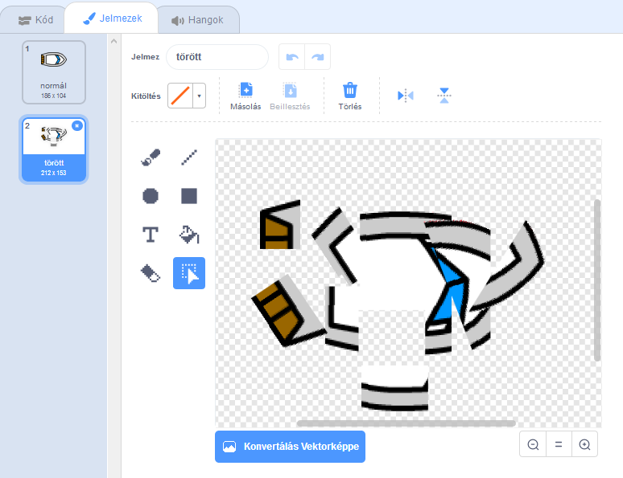

## Összeomlik!

Abban a pillanatban, a hajó hajózhat a fadarabokon! Javítsuk meg.

\--- feladat \---

Szüksége lesz két jelmezre a hajódhoz, egy szokásos jelmezbe, és egy, amikor a hajó összeomlik. Ismételje meg a hajó jelmezét, és nevezze el egy jelmez "normális" és a másik "hit".

\--- / feladat \---

\--- feladat \---

Kattintson a "hit" jelmezére, és válassza ki a Select eszközt, hogy megragadja a csónak bitjeit, és mozogjon és forgassa körül, hogy úgy nézzen ki, mintha összeomlott volna.

\--- / feladat \---

\--- feladat \---

Most adjon hozzá kódot a hajójához, hogy összeomlik és feltörjön, amikor érinti a barna fadarabokat.

\--- tippek \--- \--- tipp \--- Kódot kell hozzáadnod a `örök` hurokba, hogy a kódod ellenőrizze, hogy a hajó összeomlik-e. `Ha` a hajó `megérint` a barna színét a fa, akkor `váltani a hit kostüm`, `mondjuk Noooo! 2 másodpercig`, majd `visszatér a szokásos viselethez`. Végül `állítanod az` és a `et a kiindulási pozícióba`. \--- / tipp \--- \--- tipp \--- Itt vannak a kódblokkok, amire szükséged lesz:  \--- / tipp \--- \--- tipp \--- Itt van a kódodnak:  \--- / tipp \--- \--- / tippek \---

\--- / feladat \---

\--- feladat \---

Azt is meg kell győződnie arról, hogy a hajó mindig "normálisnak" tűnik.

Ha most megpróbálsz egy fadarabon keresztül vitorlázni, látnod kell, hogy a hajó összeomlik és visszaindul a kezdethez.

\--- / feladat \---