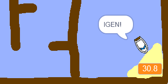

## Időzítő hozzáadása

Most hozzáad egy időzítőt a játékhoz, hogy a játékosnak a lehető leggyorsabban el kell jutnia a szigetre.

\--- feladat \---

Adjon hozzá egy új változót, az `idő`{: class = "block3variables"} nevet a Stage-nak.


[[[generic-scratch3-add-variable]]]

Az új változó megjelenítésének megváltoztatásával is kiválaszthatja az időzítő keresését.

\--- / feladat \---

\--- feladat \---

Most adjon kódblokkot a színpadhoz, hogy az időzítő addig számoljon, amíg a hajó el nem éri a szigetet.

\--- hints \--- \--- tipp \--- A színpadon `amikor a zöld zászlót rákattintják`{: class = "block3control"}, `állítsa az időt 0`{: class = "block3variables „}. A `örökkévaló`{: class = "block3control"} hurok belsejében először `várjon 0,1 másodpercet`:: class = "block3control"}, majd `módosítsa az időt 0.1`{: class = "block3variables" }. \--- / tipp \--- \--- tipp \--- Íme a szükséges kódblokkok: 

```blocks3
változtassa meg az [idő v] értékét (0,1)

ha a zászló

kattintott
végére

várakozás (0,1) másodperc

beállítása [idő v] [0]
```

\--- / tipp \--- \--- tipp \--- Íme az új kódod: 

```blocks3
ha a jelző
állított [idő v] [0]
örökre
várakozás (0,1) másodperc
változtatás [idő v] (0.1)
vége
```

\--- / tipp \--- \--- / hints \---

\--- / feladat \---

\--- feladat \---

Tesztelje ki a játékot, és nézze meg, hogy milyen gyorsan lehet a hajó a szigetre!



\--- / feladat \---