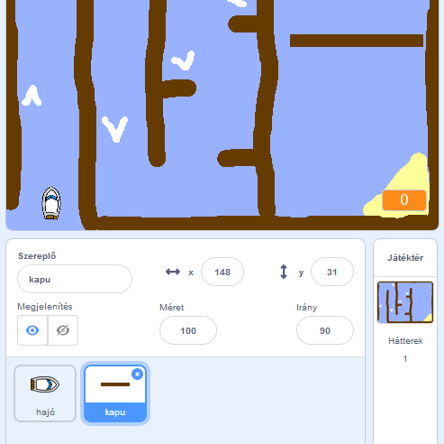
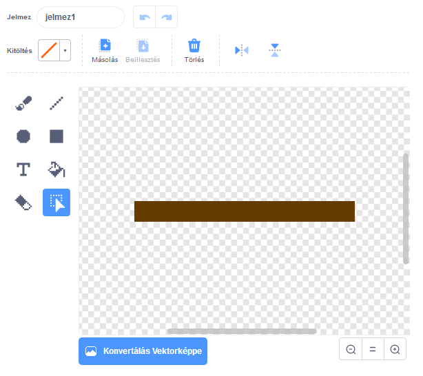
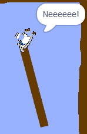

## Akadályok és erősítők

Most a játék **messze van** túl könnyű, így hozzáadhat néhány dolgot, hogy érdekesebb legyen.

Először is hozzáadunk néhány erősítőt a hajó felgyorsításához.

\--- feladat \---

Szerkessze a színpad hátterét úgy, hogy hozzáad egy fehér erősítő nyilat.


\--- / feladat \---

\--- feladat \---

Most adjon még több kódblokkot a hajó `örökre`{: class = "block3control"} hurokhoz, hogy a hajó sprite három extra lépést mozogjon, amikor egy fehér nyílra lép. 

```blocks3
ha <touching color [#FFFFFF] ?> akkor
lépés (3)
lépés vége
```

\--- / feladat \---

\--- feladat \---

Tesztelje a játékot, hogy meggyőződjön arról, hogy az új erősítő nyilak felgyorsítják-e a hajót.

\--- / feladat \---

Ezután hozzáad egy spinning kaput, amit a hajónak el kell kerülnie.

\--- feladat \---

Adjon hozzá egy új sprite-ot, amely így néz ki, és „kapu” -nak nevezi:



Győződjön meg róla, hogy a kapu sprite színe megegyezik a fából készült korlátok színével.

\--- / feladat \---

\--- feladat \---

Győződjön meg róla, hogy a kapu közepe középen van elhelyezve.



\--- / feladat \---

\--- feladat \---

Adjon hozzá kódot a kapu sprite-hez, hogy örökre lassan centrifugáljon.

\--- hints \--- \--- tipp \--- Kódblokkok hozzáadása a kapu sprite-hez, hogy `forduljon 1 fok`{: class = "block3motion"} `örökre`{: class = "block3control"} . \--- / tipp \--- \--- tipp \--- Íme a szükséges kódblokkok: 

```blocks3
örökre
vég

forgassa el a cw (1) fokot

amikor a zászlót rákattintották
```

\--- / tipp \--- \--- tipp \--- Íme az új kódod: 

```blocks3
ha a zászló
kattintott örökre
fordulat cw (1) fok
vég
```

\--- / tipp \--- \--- / hints \---

\--- / feladat \---

\--- feladat \---

Tesztelje újra a játékot. Most már van egy forgó kapu, amire szükséged van ahhoz, hogy keveredjen a hajón.



\--- / feladat \---