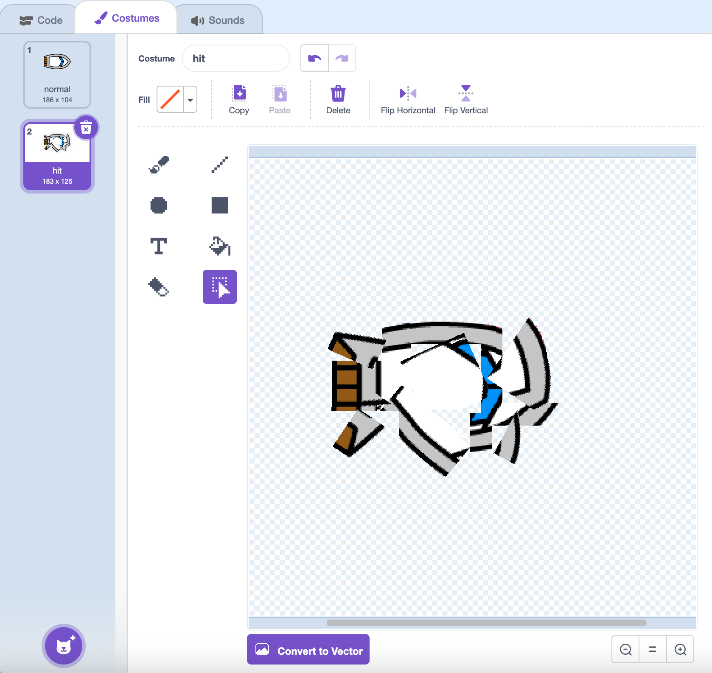

## Menabrak!

Pada saat ini, sprite kapal dapat dengan mudah melewati penghalang kayu! Anda akan memperbaikinya sekarang.

\--- tugas \---

Anda membutuhkan dua kostum untuk sprite kapal Anda: satu kostum normal, dan satu lagi untuk saat kapal menabrak. Gandakan kostum sprite kapal Anda, dan beri nama satu kostum 'normal' dan yang lainnya 'hit'.

\--- /tugas \---

\--- tugas \---

Klik pada kostum 'hit' Anda, dan gunakan alat **Select** untuk mengambil bagian-bagian dari kostum dan bergerak dan putar untuk membuat perahu terlihat seperti telah hancur berkeping-keping.



\--- /tugas \---

\--- tugas \---

Sekarang tambahkan kode ke kapal Anda sehingga crash dan pecah ketika menyentuh setiap rintangan kayu berwarna coklat.

\--- hints \--- \--- hint \--- Anda perlu menambahkan blok kode di dalam `selamanya`{: class = "block3control"} loop sehingga kode Anda terus memeriksa apakah sprite perahu telah jatuh, dan jika crash, kode perlu mengatur ulang posisi sprite kapal.

`jika`{: class = "block3control"} perahu `menyentuh`{: class = "block3sensing"} warna coklat kayu, Anda perlu `beralih ke kostum hit`{: class = "block3looks"} , `katakan Noooo! selama 2 detik`{: class = "block3looks"}, dan kemudian `beralih kembali ke kostum normal`{: class = "block3looks"}. Terakhir, Anda harus `menunjuk ke atas`{: class = "block3motion"} dan `pergi ke posisi awal`{: class = "block3motion"}.

\--- / hint \--- \--- hint \--- Ini adalah blok kode yang Anda butuhkan: 

```blocks3
jika <touching color [ ] ?> maka
akhir

pergi ke x: (-190) y: (-150)

beralih kostum ke (tekan v)

titik arah (0)

beralih kostum ke (normal v)

katakan [Tidaaaaaak!] untuk (2 detik
```

\--- / hint \--- \--- hint \--- Beginilah kode Anda seharusnya: 

```blocks3
ketika bendera diklik
titik ke arah (0)
pergi ke x: (-190) y: (-150)
selamanya
jika <(jarak ke (mouse-pointer v)) > [5]> lalu
titik ke arah (mouse- pointer v)
pindah (1) langkah
end
jika <touching color [#663b00] ?> kemudian
beralih kostum ke (tekan v)
katakan [Tidaaaaaak!] untuk (2) detik
beralih kostum ke (normal v)
titik arah (0)
pergi ke x: (-190) y: (-150)
akhir
```

\--- / hint \--- \--- / hints \---

\--- /tugas \---

\--- tugas \---

Anda juga harus menambahkan kode untuk memastikan bahwa sprite kapal Anda selalu mulai terlihat 'normal'.

Uji kembali kode Anda. Jika Anda mencoba untuk berlayar perahu melalui penghalang kayu sekarang, perahu harus jatuh dan kemudian kembali ke posisi awal.


\--- /tugas \---