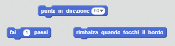
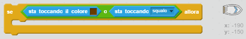

--- challenge ---

## Sfida: Ancora più ostacoli!

Sapresti aggiungere altri ostacoli al tuo gioco? Ecco alcune idee:

+ Potresti aggiungere della melma verde allo sfondo e apportare delle modifiche al gioco per far sì che la melma rallenti la barca quando il giocatore la tocca.

--- hints --- 
--- hint --- 
Puoi usare il blocco `attendi` per fare ciò: 
 
--- /hint --- 
--- /hints ---

+ Potresti aggiungere un oggetto in movimento come un tronco o uno squalo!

--- hints --- 
--- hint --- 
Questi blocchi potrebbero aiutarti a far muovere il tuo nuovo oggetto:

Se il tuo nuovo oggetto non è marrone, dovrai aggiungere dei codici alla tua barca:

 
--- /hint --- 
--- /hints ---

--- /challenge ---
