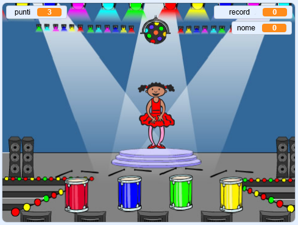

## E poi?

Congratulazioni per aver completato il progetto "Boat race"! Ti piacerebbe provare qualcosa di un po' più impegnativo?

Potresti provare il progetto [Memory](https://projects.raspberrypi.org/en/projects/memory?utm_source=pathway&utm_medium=whatnext&utm_campaign=projects).

\--- no-print \---

Clicca sulla bandiera verde per cominciare. Presta attenzione alla sequenza di colori mostrati dal vestito della ballerina e ascolta i suoni che la accompagnano. Ripeti poi i colori nella giusta sequenza. Se sbagli la sequenza dei colori, il gioco termina!

  <iframe allowtransparency="true" width="485" height="402" src="//scratch.mit.edu/projects/embed/284452634/?autostart=false" frameborder="0" allowfullscreen scrolling="no" mark="crwd-mark"></iframe> 

\--- /no-print \---

\--- print-only \---

\--- /print-only \---