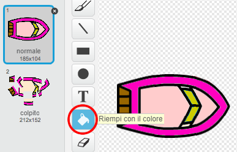

## Sfida: Altre barche!
Puoi trasformare il tuo gioco in una regata tra 2 giocatori?

+ Duplica la barca, rinominala 'Giocatore 2' e cambiagli il colore.



+ Cambia la posizione iniziale del Giocatore 2, cambiando questo codice:

```blocks
	vai a x: (-190) y: (-150)
```

+ Cancella il codice che usa il mouse per controllare la barca:

```blocks
	se < (distanza da [puntatore del mouse v]) > [5] > allora
		punta verso [puntatore del mouse v]
		fai (1) passi
	end
```

...e sostituiscilo con il codice per controllare la barca usando i tasti freccia.

Questo è il codice che dovrai usare per fare avanzare la barca:

```blocks
	se <tasto [freccia su v] premuto> allora
  		fai (1) passi
	end
```

Avrai anche bisogno del codice per `girare`{:class="blockmotion"} la barca quando le frecce a destra e sinistra sono premute.
