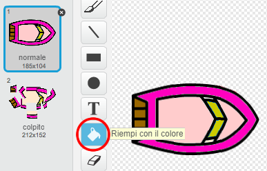

--- challenge ---

## Sfida: Ancora più barche!

Sapresti trasformare il tuo gioco in una gara tra 2 giocatori? Il secondo giocatore dovrà controllare la propria barca usando la freccia "su" per spostarsi in avanti, e le frecce "sinistra" e "destra" per girare.

--- hints --- 
--- hint --- Crea una copia della barca e cambia il colore della seconda barca.

 
--- /hint --- 
--- hint --- 
Fai in modo che le due barche partano da due punti differenti cambiando questo codice:

 
--- /hint --- 
--- hint --- 
Cancella il codice della seconda barca che permette di usare il mouse e sostituiscilo con un codice che permetta di controllare la seconda barca con le frecce. 
--- /hint --- 
--- hint --- 
Ecco il codice di cui avrai bisogno per far muovere la seconda barca in avanti:

 
--- /hint --- 
--- hint --- 
Avrai anche bisogno di un codice che faccia *ruotare* la barca quando le frecce "sinistra" e "destra" vengono premute. 
--- /hint --- 
--- /hints ---

--- /challenge ---
