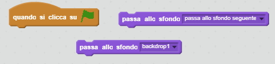

  [Progetto Scratch 2 completo scaricabile](resources/BoatRace-Finished.sb2){:download='BoatRace-Finished.sb2'}
  [Progetto Scratch 2 completo online](http://scratch.mit.edu/projects/63957956/#editor){:target="_blank"}

--- challenge ---

## Sfida: Ancora più livelli!

Sapresti creare più sfondi, per permettere al giocatore di scegliere tra vari livelli?

--- hints --- 
--- hint --- 
 
--- /hint --- 
--- /hints ---

--- /challenge ---

***

### Traduzioni della Community
Questo progetto è stato tradotto da **Silvia Caponio** e revisionato da **Alejandro Michetti**.

Il nostro straordinario team di traduttori volontari ci permette di dare ai bambini di tutto il mondo la possibilità di imparare a programmare. Puoi aiutarci a raggiungere più bambini traducendo i nostri progetti - scopri di più su [rpf.io/translators](https://rpf.io/translators).
