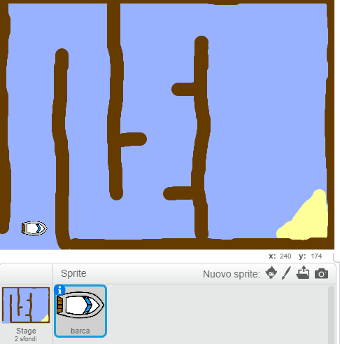

## Per cominciare

\--- task \---

Aprire il progetto iniziale.

Open the starter project at [rpf.io/boat-race-starter-on](https://rpf.io/boat-race-starter-on){:target="_blank"}.

Se hai un account Scratch puoi fare una copia cliccando su **Remix**.

\--- /task \---

Il progetto include uno sprite di una barca e lo sfondo del percorso di gara con:

- Legname che lo sprite della barca deve evitare
- Un'isola deserta che la barca deve tentare di raggiungere
    
    