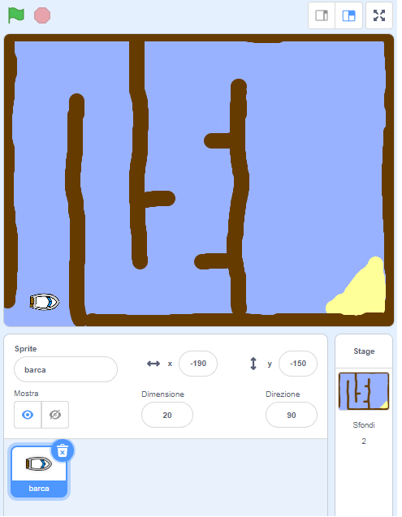

## Per cominciare

\--- task \---

Aprire il progetto iniziale.

## \--- collapse \---

title: Sto usando Scratch online

## image: images/image.png

Aprire il progetto iniziale di Scratch 'Barca da Corsa' su [jumpto.cc/boat-go](https://scratch.mit.edu/projects/63958014/#editor){:target="_blank"}. \--- /collapse \---

## \--- collapse \---

title: Sto usando Scratch offline

## image: images/image.png

Scaricare il progetto iniziale di Scratch 'Barca da Corsa' da [jumpto.cc/boat-get](http:jumpto.cc/boat-get){:target="_blank"} e aprirlo con l'editor offline. \--- /collapse \---

\--- /task \---

\--- task \---

Il progetto include una barca ed un percorso sullo sfondo con:

- Del legno, che la tua barca deve evitare
- Un'isola deserta, che la tua barca deve raggiungere
    
    

\--- /task \---