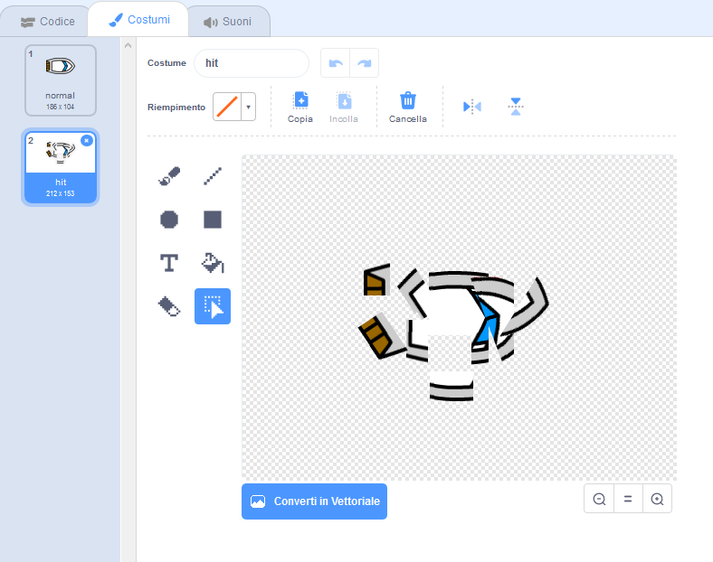

## Ci stiamo schiantando!

Al momento, lo sprite della barca può navigare attraverso le barriere di legno! Ora lo sistemerai.

\--- task \---

Avrai bisogno di due costumi per la tua barca, un costume normale e uno per quando la barca si schianta. Duplica il costume della barca e rinomina uno dei due costumi "normale", e l'altro "colpito".

\--- /task \---

\--- task \---

Clicca sul costume 'colpito' e usa lo strumento **Seleziona** per catturare i pezzi del costume; spostali e ruotali per far apparire come se la barca fosse andata in pezzi.



\--- /task \---

\--- task \---

Ora aggiungi del codice alla tua barca per far sì che si schianti e si rompa quando tocca il legno.

\--- hints \--- \--- hint \---

You need to add code blocks inside your `forever`{:class="block3control"} loop so that your code keeps checking if the boat sprite has crashed, and if it has crashed, the code needs to reset the boat sprite's position.

`if`{:class="block3control"} the boat is `touching`{:class="block3sensing"} the brown colour of the wood, you need to `switch to the hit costume`{:class="block3looks"}, `say Noooo! for 2 seconds`{:class="block3looks"}, and then `switch back to the normal costume`{:class="block3looks"}. Finally, you'll need to `point up`{:class="block3motion"} and `go to the start position`{:class="block3motion"}.

\--- /hint \--- \--- hint \---

Here are the code blocks you need:


```blocks3
if <touching color [ ] ?> then
end

go to x: (-190) y: (-150)

switch costume to (hit v)

point in direction (0)

switch costume to (normal v)

say [Noooooo!] for (2) seconds
```

\--- /hint \--- \--- hint \---

Here's what your code should look like:


```blocks3
when flag clicked
point in direction (0)
go to x: (-190) y: (-150)
forever
if <(distance to (mouse-pointer v)) > [5]> then
point towards (mouse-pointer v)
move (1) steps
end
if <touching color [#663b00] ?> then
switch costume to (hit v)
say [Noooooo!] for (2) seconds
switch costume to (normal v)
point in direction (0)
go to x: (-190) y: (-150)
end
```

\--- /hint \--- \--- /hints \---

\--- /task \---

\--- task \---

You should also add code to make sure that your boat sprite always starts out looking 'normal'.

Test your code again. If you try to sail the boat through a wooden barrier now, the boat should crash and then move back to its starting position.


\--- /task \---