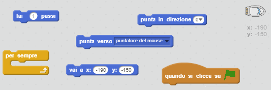
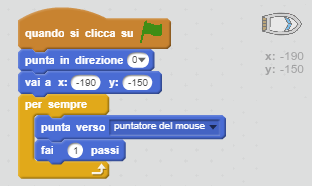
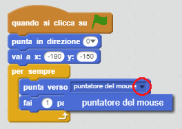
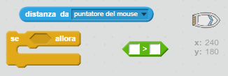
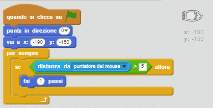

## Controllare la barca

\--- task \---

Puoi controllare la tua barca con il mouse. Aggiungi delle righe di codice alla tua barca per far sì che parta dell'angolo in basso a sinistra, puntando verso l'alto, e che segua il puntatore del mouse. **Verifica il tuo codice** per assicurarti che faccia ciò che deve fare.

\--- hints \--- \--- hint \--- `Quando si clicca su ⚑`, bisogna assicurarsi che la barca `vada in posizione iniziale` e `punti verso l'alto`. Bisogna poi fare in modo che la barca `punti verso il puntatore del mouse`, e `faccia 1 passo`. Dovrà fare ciò `per sempre`.

\--- /hint \--- \--- hint \--- Ecco di quali blocchi di codice avrai bisogno:  \--- /hint \--- \--- hint \--- Ecco come dovrebbe apparire il tuo codice:  \--- /hint \--- \--- /hints \---

\--- /task \---

\--- task \---

Prova a far navigare la tua barca cliccando sulla bandierina e muovendo il mouse. La barca punta verso il mouse?

## \--- collapse \---

title: Se è troppo difficile...

## image: images/image.png

**Nota:** Al momento ci sono alcuni problemi con Scratch, per cui potresti non essere in grado di far muovere la tua barca in direzione del puntatore del mouse. Se questo dovesse accadere, clicca la freccia sul blocco `punta verso` e seleziona di nuovo `il puntatore del mouse`.

 \--- /collapse \---

\--- /task \---

\--- task \---

Cosa succede quando la barca raggiunge il puntatore del mouse? Fai una prova.

\--- /task \---

\--- task \---

Per farlo smettere, dovrai aggiungere il blocco `se` al tuo codice, per far sì che la barca si muova solo se si trova a 5 pixel di distanza dal mouse.

\--- hints \--- \--- hint \--- La barca dovrebbe puntare in direzione del puntatore del mouse e muoversi solo `se` la `distanza dal puntatore del mouse` è `maggiore di 5 pixel`. \--- /hint \--- \--- hint \--- Ecco di quali blocchi di codice avrai bisogno:  \--- /hint \--- \--- hint \--- Ecco come dovrebbe apparire il tuo codice:  \--- /hint \--- \--- /hints \---

\--- /task \---

\--- task \---

Fai un'altra prova per vedere se il problema è stato risolto.

\--- /task \---