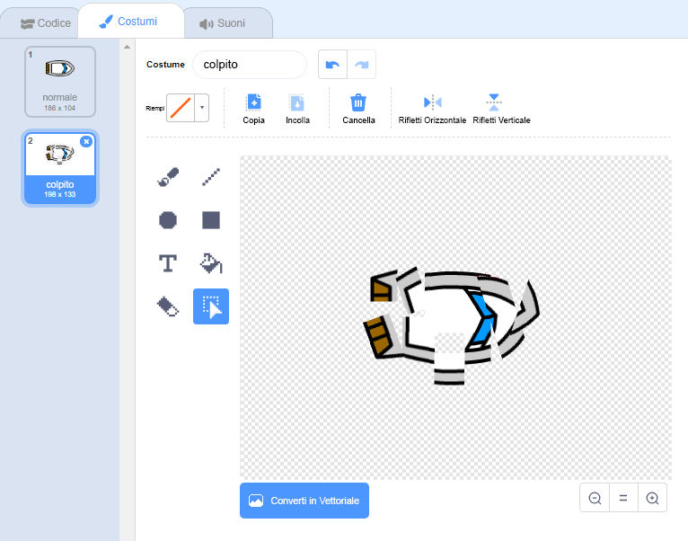
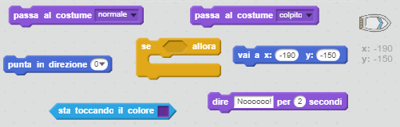
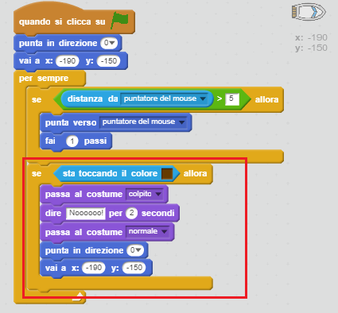
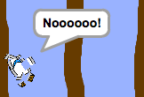

## Ci stiamo schiantando!

Al momento, la tua barca può navigare attraverso le barriere di legno! Risolviamo questo problema.

\--- task \---

Avrai bisogno di due costumi per la tua barca, un costume normale e uno per quando la barca si schianta. Duplica il tuo costume e rinomina uno dei due costumi "normale", e l'altro "colpito".

\--- /task \---

\--- task \---

Clicca sul costume "colpito" e utilizza lo strumento Seleziona per selezionare i pezzi della barca e muoverli e ruotarli per far sembrare che la barca si sia schiantata.

\--- /task \---

\--- task \---

Ora aggiungi del codice alla tua barca per far sì che si blocchi e si rompa quando tocca il legno.

\--- hints \--- \--- hint \--- Devi aggiungere del codice all'interno del blocco `per sempre` per far sì che il codice continui a controllare se la barca si è schiantata. `Se` la barca `sta toccando il colore` marrone del legno, devi `passare al costume 'colpito'`, e `dire Noooo! per 2 secondi`, e poi `tornare al costume 'normale'`. Finally, you'll need to `point up` and `go to the start position`. \--- /hint \--- \--- hint \--- Here are the code blocks you'll need:  \--- /hint \--- \--- hint \--- Here's what your code should look like:  \--- /hint \--- \--- /hints \---

\--- /task \---

\--- task \---

You should also make sure that your boat always starts out looking 'normal'.

If you try to sail through a wooden barrier now, you should see that your boat crashes and moves back to the start.

\--- /task \---