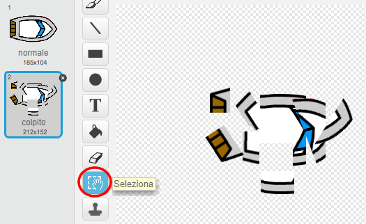

## Ci stiamo schiantando!

Al momento, la tua barca può navigare attraverso le barriere di legno! Risolviamo questo problema.

+ Avrai bisogno di due costumi per la tua barca, un costume normale e uno per quando la barca si schianta. Duplica il tuo costume e rinomina uno dei due costumi "normale", e l'altro "colpito".

+ Clicca sul costume "colpito" e utilizza lo strumento Seleziona per selezionare i pezzi della barca e muoverli e ruotarli per far sembrare che la barca si sia schiantata.
    
    

+ Ora aggiungi del codice alla tua barca per far sì che si blocchi e si rompa quando tocca il legno.

--- hints --- 
--- hint --- 
Devi aggiungere del codice all'interno del blocco `per sempre` per far sì che il codice continui a controllare se la barca si è schiantata. `Se` la barca `sta toccando il colore` marrone del legno, devi `passare al costume 'colpito'`, e `dire Noooo! per 2 secondi`, e poi `tornare al costume 'normale'`. Infine, dovrai `puntare verso l'alto` e `tornare alla posizione di partenza`. 
--- /hint --- 
--- hint --- 
Ecco di quali blocchi di codice avrai bisogno: 
 
--- /hint --- 
--- hint --- 
Ecco come dovrebbe apparire il tuo codice: 
 
--- /hint --- 
--- /hints ---

+ Dovresti inoltre assicurarti che la tua barca all'inizio abbia sempre un aspetto 'normale'.
    
    Se adesso provi a navigare attraverso una barriera di legno, la tua barca dovrebbe schiantarsi e tornare al punto di partenza.
    
    
