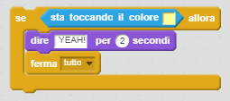

## Sfida: Vincere la sfida!

Sapresti aggiungere un altro blocco `se` al codice della tua barca per fare in modo che il giocatore vinca quando raggiunge l'isola deserta?

Quando la barca raggiunge l'isola deserta, il gioco dovrebbe dire 'Evvai!' e interrompersi.

--- hints --- 
--- hint --- 
Devi aggiungere del codice all'interno del blocco `per sempre` per far sì che il codice continui a controllare se il giocatore ha vinto. `Se` la barca `sta toccando` il colore dell'isola del tesoro, devi `dire 'YEAH!' per 2 secondi` e poi `fermare tutto` alla fine del gioco.
--- /hint --- 
--- hint --- 
Ecco di quali blocchi di codice avrai bisogno:  
--- /hint --- 
--- hint --- 
Ecco come dovrebbe apparire il tuo codice: 

Non dimenticare che il nuovo codice deve essere inserito all'interno del circuito `per sempre`. 
--- /hint --- 
--- /hints ---
